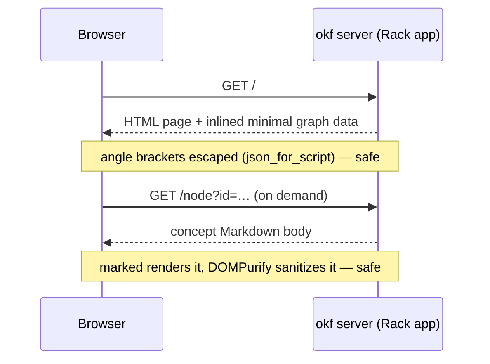

# Overview

`okf server` boots an interactive view of the [graph](../model/graph.md):
`OKF::Server::App` is a Rack app that serves one self-contained HTML page which
draws the bundle with Cytoscape and renders concept bodies with marked, sanitized
by DOMPurify. Because
it is a plain Rack app, it also mounts inside a host application (e.g. a Rails
route) — the built-in WEBrick runner is just the default, injected so tests drive
it without opening a socket.

# The page stays self-contained

One ERB template, inline CSS and JS, no build step and no bundler. The only
external assets are Cytoscape, marked, and DOMPurify from a CDN — plus Mermaid
and Panzoom, lazy-loaded only when a concept body actually contains a diagram
and when one is opened; everything else is inlined. A rendered Mermaid diagram
is **click-to-inspect**: a click, tap, or Enter re-renders it from source into a
fullscreen viewer — drag pans, wheel or pinch zooms, double-click resets, Esc
closes — so a wide flowchart is never stuck at panel width.
The graph draws from a **minimal** node payload and pulls each concept's body
**on demand** via `fetch()`, which is why even a large bundle loads fast. The
page also emits link-preview metadata — Open Graph and Twitter Card tags with a
social image, plus `theme-color` — so a shared `okf server` URL unfurls as a
proper card in chat and social apps.

# The same page, without a server

`okf render` writes that page as one static, self-contained HTML file, the whole
bundle baked in, so it hosts anywhere there is no server to answer a `fetch()` —
GitHub Pages the motivating case. It is the *same* template `okf server` renders,
one switch apart. Every data read the browser makes — a body, a description, the
catalog, the §6 map, the §7 logs — flows through a small set of getter functions,
and an injected `EMBED` constant chooses their source: `null` when served, so the
getters `fetch()` the endpoints below live; an embedded payload when rendered, so
they resolve from the page itself. One interface, two adapters, and the views
never know which is behind them. `okf render <dir>` prints to stdout (`>
public/index.html`) or writes `-o FILE`; the price is weight — every body is
inlined — so `okf server` stays the choice for a bundle too large to ship whole.

# Many bundles behind one hub

`okf server` takes *zero or more* directories. One is the classic single bundle at
`/`; two or more mount ephemerally behind `OKF::Server::Hub`; none serves the
[registry](../registry.md), opening its chosen default. The hub is a Rack app in
front of one `App` per bundle, each at `/b/<slug>/`, with `/` redirecting to the
default.

Hosting under a prefix costs almost nothing, and that is a dividend of a decision
made earlier: the page's fetch endpoints were already **mount-relative**, so the
hub needs only a clean `PATH_INFO` strip and a trailing-slash redirect — no
rewriting, no per-mount configuration. The rough edges are all navigational: a
redirect preserves the query string (a deep link survives the hop), and an unknown
slug answers `404` with a *page listing the hosted bundles*, so a bookmark left
stale by a rename gets a way home instead of bare text. `/b/` itself is a browsable
index with the default marked — a hub is navigable without the switcher, and the
empty registry lands on a page that says so rather than redirecting nowhere. Those
pages are self-contained and theme-aware like the graph page: no external requests.

The hub reads its bundles **at boot**. Registering or editing one is not picked up
by a running server — restart it. That is the honest tradeoff for a hub that never
re-scans disk per request.

# Switching bundles is a server-only affordance

Under a hub, each `App` is built carrying the *other* bundles as siblings, and the
page grows a command palette (`Cmd/Ctrl-K`, or the rail button) to filter and open
one — `Cmd/Ctrl-Enter` opens it in a new tab, and a count badge advertises the
palette until it has been opened once.

The switcher exists only where switching is *possible*. A single bundle and a
static `okf render` file inject an empty sibling list, so the affordance never
appears where there is nowhere to go — the same
one-template-two-modes discipline `EMBED` follows: the page adapts to what its
host can answer, rather than offering a control that would dead-end.

# Links navigate in-app; the graph has a second mode

Relative Markdown links inside the inspector, the files preview, and the Index
panel resolve against the open concept and navigate **in-app**: a link to a
concept selects its node, a link to an `index.md` or a bare directory opens that
directory's map, and a link to a `log.md` opens the history — reserved files used
to strike through as dead, and now every cross-reference between maps navigates.
External links open in a new tab, and links that would leave the bundle are
disabled: the page never serves a 404 from a body link. A **file-tree mode** on
the toolbar redraws the bundle as folders-become-nodes with only folder→child
edges — the acyclic layered tree of the files, next to the emergent link graph.
The inspector and files panes are drag-resizable (persisted; double-click resets),
and the inspector boots hidden on every screen until the first node tap.

# One page, from a phone to a desktop

At `≤768px` — phones and portrait tablets — the topbar tools fold into a `⚙`
sheet, panels go full-bleed, the file list collapses to its tab bar, and the graph
fits itself after load. The sheet shows when a filter is active, so a control
folded out of sight can never silently narrow what the graph is showing.

The breakpoint tracks the width actually available to the chrome, not a device
class, which is why rotation is a re-evaluation rather than a one-way door: the
same tablet crosses back over `769px` in landscape and gets the desktop layout,
and `orientationchange` refits the graph to its new box.

# The browser shows the authored layer, not just derived views

The graph, catalog, files, tags, and stats panels are all *derived* from the
model; the one layer humans actually write — the §6 index map and the
[§7 log](../format/okf-format.md) — now renders in the browser too. The tree
column carries two tabs: **Files** groups each directory's concepts (foldable,
with its `index.md` and `log.md` beside them), and **Indexes** lays the authored
layer flat — the log first as the chronological index, then every `index.md`, root
before nested. Folder nodes in file-tree mode and area boxes in cluster mode are
clickable: the inspector opens that directory's map, the authored `index.md` or a
synthesized listing badged as such when none exists; **Open in graph** on a
reserved file jumps to its folder in the tree, where a file with no node still has
a home. The log is read **live from disk** on every open, so an entry a `maintain`
pass just appended shows without a restart. This closes the parity gap from the
other side of [search](search.md): the CLI's [`index` map](read-views.md) had no
browser twin, just as the browser's search had no CLI verb — now each medium shows
both.

# Request flow

# Endpoints

| Path | Serves |
|------|--------|
| `/` | the HTML page (graph + inlined minimal data) |
| `/node?id=` | one concept's rendered body |
| `/node/meta?id=` | one concept's metadata |
| `/catalog`, `/tags`, `/types` | the JSON behind the browser panels |
| `/index` | the §6 map for the Indexes tab (boot snapshot) |
| `/log` | every `log.md`, read live from disk for the Log |

Under a hub every path above keeps its shape, mounted under its bundle's prefix
(`/b/<slug>/node?id=`), plus the hub's own `/` (redirect to the default) and `/b/`
(the bundle index).

# Responses are gzipped on the wire

Under `okf server`, every response is gzipped when the client accepts it:
`Rack::Deflater` wraps the app at the boot seam — `serve`, the one path *both* a
single bundle and a [hub](../registry.md) pass through — so the browser
decompresses transparently and the heaviest payloads — the inlined minimal graph,
the full-body JSON — cross the wire at a fraction of their size. Putting the wrap
at the shared seam rather than in either mode is what makes it total: a mode added
later gets compression for free, and neither mode can forget it. The wrap is boot
policy, not part of the app: a host that mounts `OKF::Server::App` brings its own
compression, and `okf render`'s static file carries none (whatever hosts it
compresses instead). It costs [no new dependency](../design/runtime-dependencies.md) —
`Rack::Deflater` ships inside the `rack` the gem already requires — and a client
that sends no `Accept-Encoding` (plain `curl`) still gets an identity response.

# Trust boundary

Both paths into the page are guarded. Inlined data goes through `json_for_script`,
which escapes `<` so it cannot break out of its `<script>`; each fetched body is
run through `DOMPurify.sanitize(marked.parse(...))`, which strips any script or
handler before it reaches the DOM. See the
[server trust boundary](../design/server-trust-boundary.md) for what that does and
does not cover.

# Citations

[1] [lib/okf/server/app.rb](https://github.com/serradura/okf-gem/blob/main/lib/okf/server/app.rb) — the Rack app, its routes, and `render_static`.
[2] [lib/okf/cli.rb](https://github.com/serradura/okf-gem/blob/main/lib/okf/cli.rb) — the `render` verb (the static counterpart to `server`) and the `serve` boot seam that wraps every served app in `Rack::Deflater`.
[3] [lib/okf/server/hub.rb](https://github.com/serradura/okf-gem/blob/main/lib/okf/server/hub.rb) — the multi-bundle dispatcher: the `/b/<slug>/` mounts, the default redirect, and the hub's own index, empty-state, and 404 pages.
