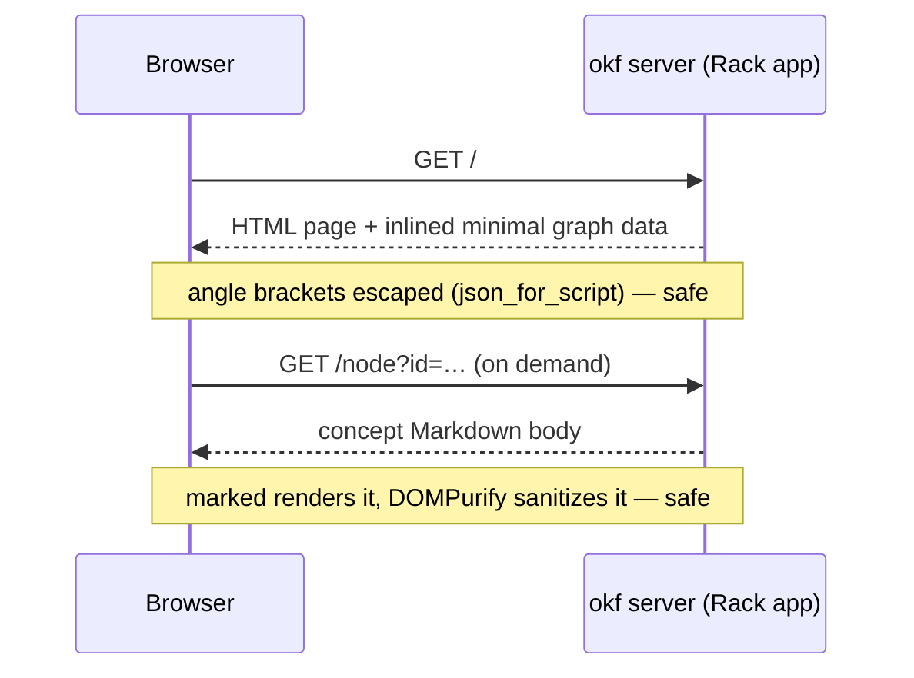

# Overview

`okf server` boots an interactive view of the [graph](../model/graph.md):
`OKF::Server::App` is a Rack app that serves one self-contained HTML page which
draws the bundle with Cytoscape and renders concept bodies with marked, sanitized
by DOMPurify. Because
it is a plain Rack app, it also mounts inside a host application (e.g. a Rails
route) — the built-in WEBrick runner is just the default, injected so tests drive
it without opening a socket.

# The page stays self-contained

One ERB template, inline CSS and JS, no build step and no bundler. The only
external assets are Cytoscape, marked, and DOMPurify from a CDN — plus Mermaid,
lazy-loaded only when a concept body actually contains a diagram; everything else
is inlined.
The graph draws from a **minimal** node payload and pulls each concept's body
**on demand** via `fetch()`, which is why even a large bundle loads fast. The
page also emits link-preview metadata — Open Graph and Twitter Card tags with a
social image, plus `theme-color` — so a shared `okf server` URL unfurls as a
proper card in chat and social apps.

# Links navigate in-app; the graph has a second mode

Relative Markdown links inside the inspector and the files preview resolve
against the open concept and navigate **in-app** — clicking `../model/graph.md`
selects that node instead of 404ing the page. External links open in a new tab,
and links that would leave the bundle are disabled: the page never serves a 404
from a body link. A **file-tree mode** on the toolbar redraws the bundle as
folders-become-nodes with only folder→child edges — the acyclic layered tree of
the files, next to the emergent link graph. The inspector and files panes are
drag-resizable (persisted; double-click resets), and on small screens the
inspector stays hidden until the first node tap.

# Request flow

# Endpoints

| Path | Serves |
|------|--------|
| `/` | the HTML page (graph + inlined minimal data) |
| `/node?id=` | one concept's rendered body |
| `/node/meta?id=` | one concept's metadata |
| `/catalog`, `/tags`, `/types` | the JSON behind the browser panels |

# Trust boundary

Both paths into the page are guarded. Inlined data goes through `json_for_script`,
which escapes `<` so it cannot break out of its `<script>`; each fetched body is
run through `DOMPurify.sanitize(marked.parse(...))`, which strips any script or
handler before it reaches the DOM. See the
[server trust boundary](../design/server-trust-boundary.md) for what that does and
does not cover.

# Citations

[1] [lib/okf/server/app.rb](https://github.com/serradura/okf-gem/blob/main/lib/okf/server/app.rb) — the Rack app and its routes.
