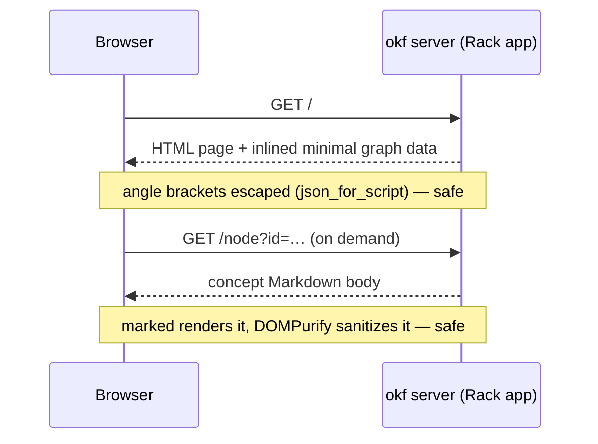

# Overview

`okf server` boots an interactive view of the [graph](../model/graph.md):
`OKF::Server::App` is a Rack app that serves one self-contained HTML page which
draws the bundle with Cytoscape and renders concept bodies with marked, sanitized
by DOMPurify. Because
it is a plain Rack app, it also mounts inside a host application (e.g. a Rails
route) — the built-in WEBrick runner is just the default, injected so tests drive
it without opening a socket.

# The page stays self-contained

One ERB template, inline CSS and JS, no build step and no bundler. The only
external assets are Cytoscape, marked, and DOMPurify from a CDN — plus Mermaid
and Panzoom, lazy-loaded only when a concept body actually contains a diagram
and when one is opened; everything else is inlined. A rendered Mermaid diagram
is **click-to-inspect**: a click, tap, or Enter re-renders it from source into a
fullscreen viewer — drag pans, wheel or pinch zooms, double-click resets, Esc
closes — so a wide flowchart is never stuck at panel width.
The graph draws from a **minimal** node payload and pulls each concept's body
**on demand** via `fetch()`, which is why even a large bundle loads fast. The
page also emits link-preview metadata — Open Graph and Twitter Card tags with a
social image, plus `theme-color` — so a shared `okf server` URL unfurls as a
proper card in chat and social apps.

# The same page, without a server

`okf render` writes that page as one static, self-contained HTML file, the whole
bundle baked in, so it hosts anywhere there is no server to answer a `fetch()` —
GitHub Pages the motivating case. It is the *same* template `okf server` renders,
one switch apart. Every data read the browser makes — a body, a description, the
catalog, the §6 map, the §7 logs — flows through a small set of getter functions,
and an injected `EMBED` constant chooses their source: `null` when served, so the
getters `fetch()` the endpoints below live; an embedded payload when rendered, so
they resolve from the page itself. One interface, two adapters, and the views
never know which is behind them. `okf render <dir>` prints to stdout (`>
public/index.html`) or writes `-o FILE`; the price is weight — every body is
inlined — so `okf server` stays the choice for a bundle too large to ship whole.

# Links navigate in-app; the graph has a second mode

Relative Markdown links inside the inspector, the files preview, and the Index
panel resolve against the open concept and navigate **in-app**: a link to a
concept selects its node, a link to an `index.md` or a bare directory opens that
directory's map, and a link to a `log.md` opens the history — reserved files used
to strike through as dead, and now every cross-reference between maps navigates.
External links open in a new tab, and links that would leave the bundle are
disabled: the page never serves a 404 from a body link. A **file-tree mode** on
the toolbar redraws the bundle as folders-become-nodes with only folder→child
edges — the acyclic layered tree of the files, next to the emergent link graph.
The inspector and files panes are drag-resizable (persisted; double-click resets),
and on small screens the inspector stays hidden until the first node tap.

# The browser shows the authored layer, not just derived views

The graph, catalog, files, tags, and stats panels are all *derived* from the
model; the one layer humans actually write — the §6 index map and the
[§7 log](../format/okf-format.md) — now renders in the browser too. The tree
column carries two tabs: **Files** groups each directory's concepts (foldable,
with its `index.md` and `log.md` beside them), and **Indexes** lays the authored
layer flat — the log first as the chronological index, then every `index.md`, root
before nested. Folder nodes in file-tree mode and area boxes in cluster mode are
clickable: the inspector opens that directory's map, the authored `index.md` or a
synthesized listing badged as such when none exists; **Open in graph** on a
reserved file jumps to its folder in the tree, where a file with no node still has
a home. The log is read **live from disk** on every open, so an entry a `maintain`
pass just appended shows without a restart. This closes the parity gap from the
other side of [search](search.md): the CLI's [`index` map](read-views.md) had no
browser twin, just as the browser's search had no CLI verb — now each medium shows
both.

# Request flow

# Endpoints

| Path | Serves |
|------|--------|
| `/` | the HTML page (graph + inlined minimal data) |
| `/node?id=` | one concept's rendered body |
| `/node/meta?id=` | one concept's metadata |
| `/catalog`, `/tags`, `/types` | the JSON behind the browser panels |
| `/index` | the §6 map for the Indexes tab (boot snapshot) |
| `/log` | every `log.md`, read live from disk for the Log |

# Trust boundary

Both paths into the page are guarded. Inlined data goes through `json_for_script`,
which escapes `<` so it cannot break out of its `<script>`; each fetched body is
run through `DOMPurify.sanitize(marked.parse(...))`, which strips any script or
handler before it reaches the DOM. See the
[server trust boundary](../design/server-trust-boundary.md) for what that does and
does not cover.

# Citations

[1] [lib/okf/server/app.rb](https://github.com/serradura/okf-gem/blob/main/lib/okf/server/app.rb) — the Rack app, its routes, and `render_static`.
[2] [lib/okf/cli.rb](https://github.com/serradura/okf-gem/blob/main/lib/okf/cli.rb) — the `render` verb, the static counterpart to `server`.
