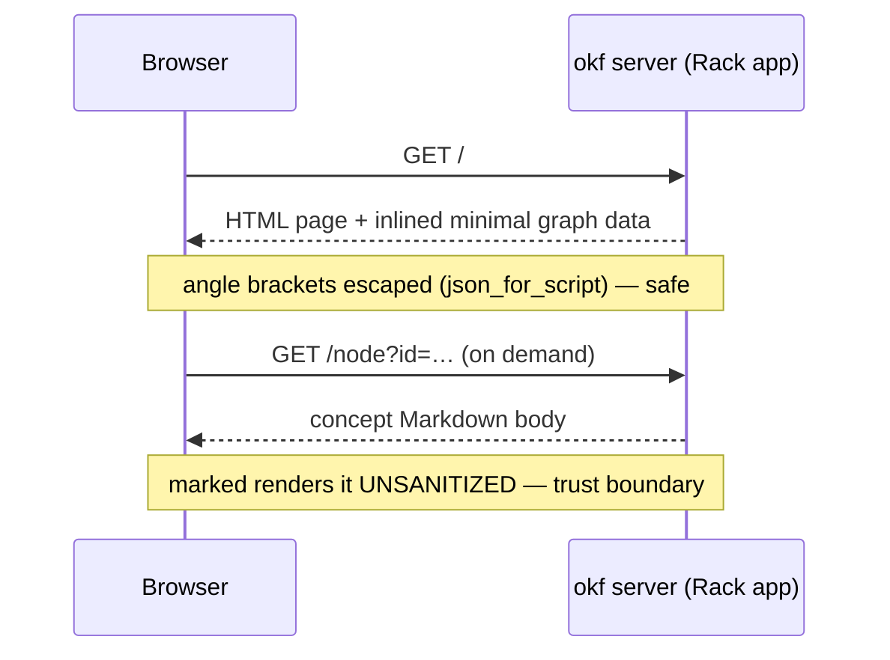

# Overview

`okf server` boots an interactive view of the [graph](../model/graph.md):
`OKF::Server::App` is a Rack app that serves one self-contained HTML page which
draws the bundle with Cytoscape and renders concept bodies with marked. Because
it is a plain Rack app, it also mounts inside a host application (e.g. a Rails
route) — the built-in WEBrick runner is just the default, injected so tests drive
it without opening a socket.

# The page stays self-contained

One ERB template, inline CSS and JS, no build step and no bundler. The only
external assets are Cytoscape and marked from a CDN — plus Mermaid, lazy-loaded
only when a concept body actually contains a diagram; everything else is inlined.
The graph draws from a **minimal** node payload and pulls each concept's body
**on demand** via `fetch()`, which is why even a large bundle loads fast.

# Request flow

# Endpoints

| Path | Serves |
|------|--------|
| `/` | the HTML page (graph + inlined minimal data) |
| `/node?id=` | one concept's rendered body |
| `/node/meta?id=` | one concept's metadata |
| `/catalog`, `/tags`, `/types` | the JSON behind the browser panels |

# Trust boundary

Fetched Markdown bodies are rendered **without sanitization**, so only serve
bundles you trust. Data inlined into the page is safe — it goes through
`json_for_script`, which escapes `<` so it cannot break out of its `<script>` —
but the on-demand body is not. See the
[server trust boundary](../design/server-trust-boundary.md) for the full picture.

# Citations

[1] [lib/okf/server/app.rb](https://github.com/serradura/okf-gem/blob/main/lib/okf/server/app.rb) — the Rack app and its routes.
