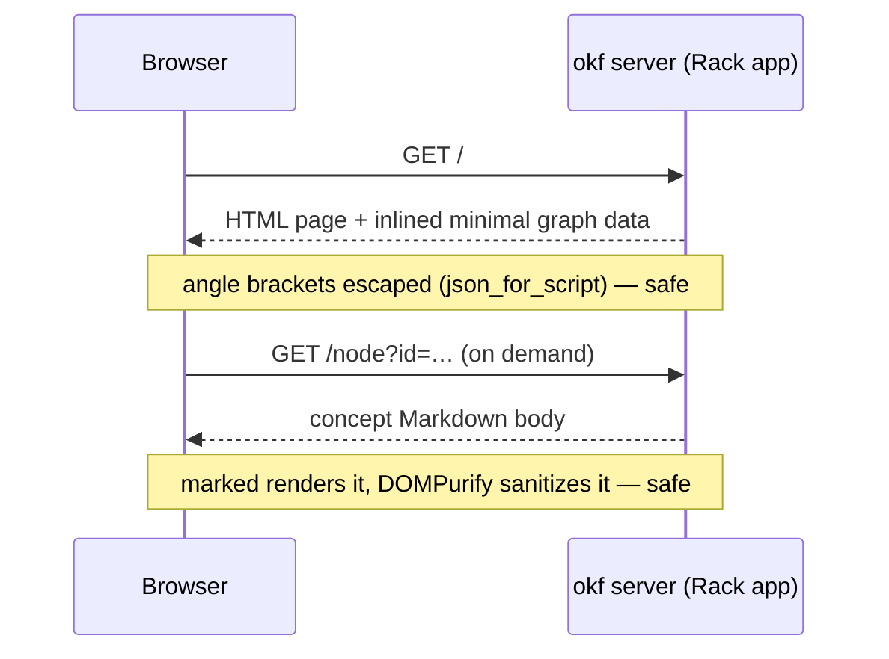

# Overview

`okf server` boots an interactive view of the [graph](../model/graph.md):
`OKF::Server::App` is a Rack app that serves one self-contained HTML page which
draws the bundle with Cytoscape and renders concept bodies with marked, sanitized
by DOMPurify. Because
it is a plain Rack app, it also mounts inside a host application (e.g. a Rails
route) — the built-in WEBrick runner is just the default, injected so tests drive
it without opening a socket.

# The page stays self-contained

One ERB template, inline CSS and JS, no build step and no bundler. The only
external assets are Cytoscape, marked, and DOMPurify from a CDN — plus Mermaid,
Panzoom, and MiniSearch, lazy-loaded on first use (a concept body's diagram
opened, the search box focused); everything else is inlined. A rendered Mermaid diagram
is **click-to-inspect**: a click, tap, or Enter re-renders it from source into a
fullscreen viewer — drag pans, wheel or pinch zooms, double-click resets, Esc
closes — so a wide flowchart is never stuck at panel width.
The graph draws from a **minimal** node payload and pulls each concept's body
**on demand** via `fetch()`, which is why even a large bundle loads fast. The
page also emits link-preview metadata — Open Graph and Twitter Card tags with a
social image, plus `theme-color` — so a shared `okf server` URL unfurls as a
proper card in chat and social apps.

# The same page, without a server

The same template also ships *without* a server: [`okf render`](render.md) bakes
the whole bundle into one static, self-contained HTML file, so the graph hosts
anywhere nothing can answer a `fetch()`. It is one switch apart from what `server`
serves — a single injected `EMBED` adapter swaps the live endpoints below for an
inlined payload — so there is no second renderer to keep in sync. See
[static render](render.md) for the embedded-data path, the baked-in flags, and the
weight it trades for needing no server.

# Many bundles behind one hub

`okf server` takes *zero or more* directories. One is the classic single bundle at
`/`; two or more mount ephemerally behind `OKF::Server::Hub`; none serves the
[registry](../registry.md), opening its chosen default. The hub is a Rack app in
front of one `App` per bundle, each at `/b/<slug>/`, with `/` redirecting to the
default.

Hosting under a prefix costs almost nothing, and that is a dividend of a decision
made earlier: the page's fetch endpoints were already **mount-relative**, so the
hub needs only a clean `PATH_INFO` strip and a trailing-slash redirect — no
rewriting, no per-mount configuration. The rough edges are all navigational: a
redirect preserves the query string (a deep link survives the hop), and an unknown
slug answers `404` with a *page listing the hosted bundles*, so a bookmark left
stale by a rename gets a way home instead of bare text. `/b/` itself is a browsable
index with the default marked — a hub is navigable without the switcher, and the
empty registry lands on a page that says so rather than redirecting nowhere. Those
pages are self-contained and theme-aware like the graph page: no external requests.

The hub reads its bundles **at boot**. Registering or editing one is not picked up
by a running server — restart it. That is the honest tradeoff for a hub that never
re-scans disk per request.

# One palette, every mode

`Cmd/Ctrl-K` (or the rail button) opens a command palette in **every** mode —
hub, single bundle, static render. It began as the hub's bundle switcher, gated
on the hub's presence, which left the two modes most people meet first with no
palette at all; now the palette is universal and *bundles* are the group that
comes and goes. Under a hub, each `App` is built carrying the *other* bundles as
siblings: bundles lead the list and own the empty box, `Cmd/Ctrl-Enter` opens
one in a new tab, and a count badge advertises the palette until it has been
opened once. Views ride underneath, each carrying the rail's own icon and label
— read from the rail, so the two cannot drift — and where there is no hub, views
become the whole list. What never appears is a dead end: a standalone page
injects an empty sibling list, so the palette offers a bundle only where its
host can answer with one — the same one-template-two-modes discipline `EMBED`
follows.

The keyboard reaches the rest of the page the same way: `/` focuses the current
view's search where it has one, and `?` answers with a sheet of every binding —
reachable from a rail button too, because a shortcut list you can only open with
a shortcut helps whoever needs it least. The sheet is written against the key
handler it documents, so it cannot drift from what the keys do.

# The search box is full-text, and client-side

The one search box is backed by a full-text index —
[MiniSearch](https://github.com/lucaong/minisearch), lazy-loaded on first focus
and pinned to the same `7.2.0` the Ruby [`minifts`](search.md) port tracks, so a
Ruby-built index and the browser's rank identically. It indexes title, id,
type, tags and **description** in every mode, plus each concept's **body**
wherever the page already holds it: `okf render` bakes every body in, so a static
file searches bodies offline; the live server keeps bodies lazy, so its index
stays metadata-only until a backend body index arrives. Matches are ranked,
multi-term (`AND`), prefix (as-you-type) and typo-tolerant, and drive the graph,
catalog and files views alike; the **Indexes** tab carries a second index over
each `index.md`/`log.md` **body**, not just its filename. Until an index loads —
or if the CDN is unreachable — each view falls back to its own substring filter,
so the box is never dead. The browser and the CLI's [`search`](search.md) used to
diverge here — the CLI a deterministic substring scan, the browser fuzzy — and
that gap is now **closed from the other side**: the CLI runs the same engine
through the `minifts` port, so both rank by the same BM25+ arithmetic and differ
only in the options each passes. The browser searches as you type and forgives
typos because a human wants the near miss; the CLI stays exact until `--fuzzy`
because an agent citing a row wants the field that actually hit.

# Links navigate in-app; the graph has a second mode

Relative Markdown links inside the inspector, the files preview, and the Index
panel resolve against the open concept and navigate **in-app**: a link to a
concept selects its node, a link to an `index.md` or a bare directory opens that
directory's map, and a link to a `log.md` opens the history — reserved files used
to strike through as dead, and now every cross-reference between maps navigates.
External links open in a new tab, and links that would leave the bundle are
disabled: the page never serves a 404 from a body link. A **file-tree mode** on
the toolbar redraws the bundle as folders-become-nodes with only folder→child
edges — the acyclic layered tree of the files, next to the emergent link graph.
The inspector and files panes are drag-resizable (persisted; double-click resets),
and the inspector boots hidden on every screen until the first node tap.

A filter or search that empties an area hides that area's **box** too, rather
than stranding a labelled empty rectangle: the filter recomputes each compound
parent from its surviving children, and clustering re-applies the active filter
before the layout tiles the boxes, so the two orders — filter-then-cluster and
cluster-then-filter — agree. Selection clears with `Esc` as well as a tap on
empty canvas, because a dense graph leaves almost no empty canvas to hit.

# One page, from a phone to a desktop

At `≤768px` — phones and portrait tablets — the topbar tools fold into a `⚙`
sheet, panels go full-bleed, the file list collapses to its tab bar, and the graph
fits itself after load. The sheet shows when a filter is active, so a control
folded out of sight can never silently narrow what the graph is showing.

The breakpoint tracks the width actually available to the chrome, not a device
class, which is why rotation is a re-evaluation rather than a one-way door: the
same tablet crosses back over `769px` in landscape and gets the desktop layout,
and `orientationchange` refits the graph to its new box.

# The graph opens the page, and a note says the index is there

A bundle read as documentation has to answer "where do I start?", and a field of
unlabelled dots does not say it on its own. The page still **opens on the graph**
— that constellation is what makes a bundle legible at a glance, and it is the
one view that reads well at every width. What the graph cannot say is that the
bundle has an index, so a **dismissible note at the bottom says it once**: what
the picture is, how to touch it, and that the index exists. **Read the index**
takes the reader straight there; `✕` and the button both remember the dismissal
in `localStorage`, so a returning visitor never sees it again.

Landing on the index instead was tried and reverted. It read well on a wide
window and badly everywhere else: a phone got a wall of prose where the
constellation should have been, and every visitor — first or five-hundredth —
paid for an introduction only the first one needed. A note costs one visit; a
landing costs all of them.

The note belongs to the graph (`#app:not([data-view=graph]) ~ #hello`, a
**sibling** combinator, because it sits outside `#app` with the other fixed
overlays) so it never floats over a reader, and it absorbed the old mobile-only
tip rather than stacking a second banner beneath it.

## The wording follows the device on two gates, not one

Width answers neither question on its own. What a reader **does** follows
`(pointer:coarse)` — a touch tablet in landscape is wider than 768px and still
taps; a narrow desktop window is narrower and still clicks. What a reader can
**reach** follows `(max-width:768px)` — `☰` exists only once the rail collapses,
so promising it at any other width is a lie. A pointer-less environment matches
neither and keeps the click wording, which is the safe default. `(max-height:480px)`
tightens the setting, and short *and* wide puts the question beside the button so
the card spends width instead of height — a landscape phone went from half the
screen to under a third.

## A second beat, where the menu is the only way through

On a compact layout the rail is folded behind `☰`, so a reader who has just left
the graph cannot see where the other views went. A second, lighter note says so
— anchored **under the button it is about**, with a caret pointing at it, because
a bottom sheet naming a top-left control asks the reader to do the mapping.

It fires on *leaving the graph* by any route rather than off the first note's
button, so the reader who dismissed that note and found their own way still gets
told. Opening `☰` answers it — but only when the note is actually on screen: `☰`
is the only way off the graph there, so the first tap always *precedes* the note,
and marking it done then would burn the flag on a hint nobody saw. It carries its
own `localStorage` key, so dismissing one is not dismissing both.

Both notes are the same guide speaking, and share a vocabulary by sharing
selectors rather than by resembling each other: one rule draws the three node
dots, one dresses both buttons. Ink-on-background rather than the accent is the
only pairing that clears 4.5:1 in **both** themes, which leaves the dots as the
one piece of colour in either card. Everything is written for a finger: a
first-time reader on a phone is the least oriented person the page ever serves,
and "click" means nothing to them.

**Read the index** opens the index. That reads as tautology and was a bug: it
called the action that opens the *panel listing* the indexes, which lands on
"Pick a file on the left" — a button that names a destination owes the reader
the destination, not the drawer it lives in.

Deep links are unaffected, and `?select=`/`#hash` now name a view as well as a
node — selecting into a graph nobody is looking at is a silent no-op, and
`setView` returning early when the view is already current makes that free.

# The browser shows the authored layer, not just derived views

The graph, catalog, files, tags, and stats panels are all *derived* from the
model; the one layer humans actually write — the §6 index map and the
[§7 log](../format/okf-format.md) — now renders in the browser too. The tree
column carries two tabs: **Files** is a real explorer — directories *nest*, one
row per path segment indented by depth, so `core/configurations` sits inside
`core` instead of standing beside it as a sorted full path did, and closing a
folder takes its whole subtree with it (foldable whether or not a search is
narrowing them, with a fold/unfold-all control in the tab header; a collapsed
group still shows its header, so it never hides a match, and a folder that holds
nothing but folders still renders, or the chain to its children would break).
The fold controls read every folder in the tree rather than the ones on screen,
and they treat the root as not theirs to fold: "collapse all" folds everything
*inside* it and leaves the root open, because folding the root too answers the
click with a lone `(root)` row and hides the top-level folders — the one thing a
reader wants left standing after collapsing everything. Unfolding clears the
whole set, root included, so a root closed by hand is still reversible from
there.
**Indexes** lays the authored layer flat — the log first as the chronological
index, then every `index.md`, root before nested. Folder nodes in file-tree mode and area boxes in cluster mode are
clickable: the inspector opens that directory's map, the authored `index.md` or a
synthesized listing badged as such when none exists; **Open in graph** on a
reserved file jumps to its folder in the tree, where a file with no node still has
a home. The log is read **live from disk** on every open, so an entry a `maintain`
pass just appended shows without a restart. This closes the parity gap from the
other side of [search](search.md): the CLI's [`index` map](read-views.md) had no
browser twin, just as the browser's search had no CLI verb — now each medium shows
both.

# Request flow

# Endpoints

| Path | Serves |
|------|--------|
| `/` | the HTML page (graph + inlined minimal data) |
| `/node?id=` | one concept's rendered body |
| `/node/meta?id=` | one concept's metadata |
| `/catalog`, `/tags`, `/types` | the JSON behind the browser panels |
| `/index` | the §6 map for the Indexes tab (boot snapshot) |
| `/log` | every `log.md`, read live from disk for the Log |

Under a hub every path above keeps its shape, mounted under its bundle's prefix
(`/b/<slug>/node?id=`), plus the hub's own `/` (redirect to the default) and `/b/`
(the bundle index).

# Responses are gzipped on the wire

Under `okf server`, every response is gzipped when the client accepts it:
`Rack::Deflater` wraps the app at the boot seam — `serve`, the one path *both* a
single bundle and a [hub](../registry.md) pass through — so the browser
decompresses transparently and the heaviest payloads — the inlined minimal graph,
the full-body JSON — cross the wire at a fraction of their size. Putting the wrap
at the shared seam rather than in either mode is what makes it total: a mode added
later gets compression for free, and neither mode can forget it. The wrap is boot
policy, not part of the app: a host that mounts `OKF::Server::App` brings its own
compression, and `okf render`'s static file carries none (whatever hosts it
compresses instead). It costs [no new dependency](../design/runtime-dependencies.md) —
`Rack::Deflater` ships inside the `rack` the gem already requires — and a client
that sends no `Accept-Encoding` (plain `curl`) still gets an identity response.

# Trust boundary

Both paths into the page are guarded. Inlined data goes through `json_for_script`,
which escapes `<` so it cannot break out of its `<script>`; each fetched body is
run through `DOMPurify.sanitize(marked.parse(...))`, which strips any script or
handler before it reaches the DOM. See the
[server trust boundary](../design/server-trust-boundary.md) for what that does and
does not cover.

# Citations

[1] [lib/okf/server/app.rb](https://github.com/serradura/okf-gem/blob/main/lib/okf/server/app.rb) — the Rack app and its routes; `GET /` renders the page through [`OKF::Render::Graph`](render.md).
[2] [lib/okf/cli.rb](https://github.com/serradura/okf-gem/blob/main/lib/okf/cli.rb) — the `serve` boot seam that wraps every served app in `Rack::Deflater` (the static counterpart, [`render`](render.md), is its own capability).
[3] [lib/okf/server/hub.rb](https://github.com/serradura/okf-gem/blob/main/lib/okf/server/hub.rb) — the multi-bundle dispatcher: the `/b/<slug>/` mounts, the default redirect, and the hub's own index, empty-state, and 404 pages.
[4] [lib/okf/render/graph/template.html.erb](https://github.com/serradura/okf-gem/blob/main/lib/okf/render/graph/template.html.erb) — the page itself: the two MiniSearch indexes behind the search box, the compound-parent visibility pass that keeps emptied area boxes off the canvas, and the file tree's fold controls.
