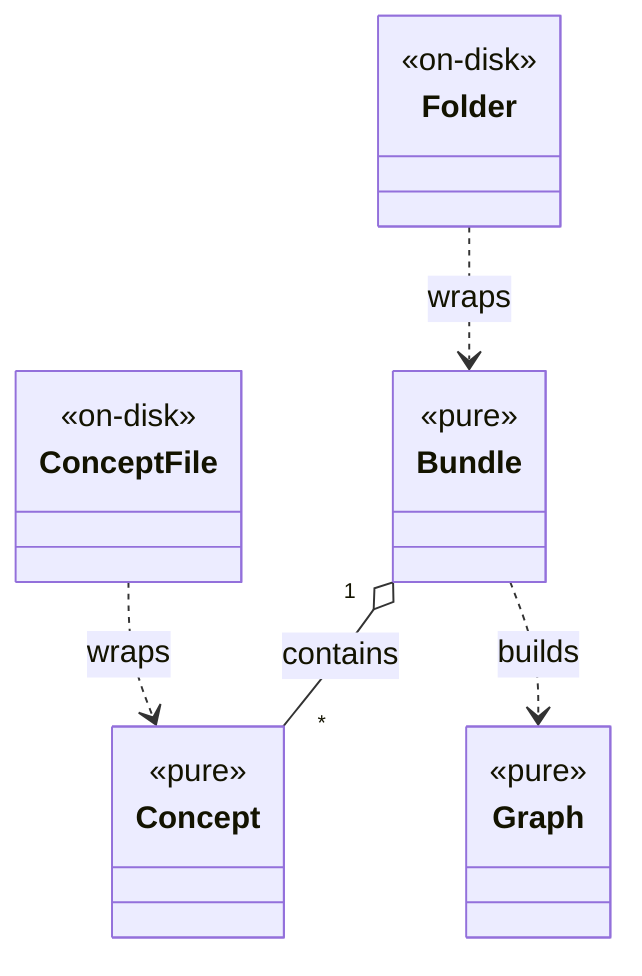

# Overview

Everything the [CLI](../cli.md) does is available in-process. `require "okf"`
gives you two layers, split cleanly by the [core/shell rule](../design/core-shell-split.md):

- **pure, in-memory** — [`OKF::Concept`](../model/concept.md) and
  [`OKF::Bundle`](../model/bundle.md), which you build, interrogate, validate,
  lint, and graph with **no disk involved**;
- **on-disk handles** — `OKF::Concept::File` and `OKF::Bundle::Folder`, which add
  `load` / `save` / `reload` / `delete` on top of the pure model.

`require "okf"` stops at those two layers: the [CLI](../cli.md) and the skill
installer load only when asked for (from `okf/exe/okf`, or an explicit
`require "okf/cli"` / `require "okf/skill"`), so an app embedding the library
never drags in the command-line machinery. The
[registry](../registry.md) and the server's hub sit behind the same door — the CLI
requires them at the moment a registry verb or a multi-bundle `server` runs, so
the library surface stays the same size no matter what the executable grows.

`ConceptFile` is `OKF::Concept::File`; `Folder` is `OKF::Bundle::Folder` — each
on-disk handle wraps a pure counterpart and adds load/save/reload/delete.

# Build knowledge without touching Markdown

The pure layer is the surface an embedding app uses to reuse the gem over
knowledge it already holds as records. Construct concepts from data, assemble a
bundle, and call `#validate`, `#lint`, or `#graph` — no Markdown round-trip
needed. The lower-level pieces work standalone too:
`OKF::Bundle::Validator.call`, `OKF::Bundle::Linter.call`,
`OKF::Bundle::Search.call`, `OKF::Bundle::Graph.build`,
`OKF::Markdown::Frontmatter.parse`.

# Folder is an ActiveRecord for the filesystem

`OKF::Bundle::Folder.load(dir)` reads a directory into a pure bundle;
`Folder.new(bundle:, root:).save` materializes one back — and **validates §9
before publishing** through an atomic writer, so it never leaves a broken bundle
on disk. `OKF::Server::App.new(folder)` turns a folder straight into the
[graph server](graph-server.md) — mountable anywhere, and the one option a mount
owns is `search_endpoint:`, since the page resolves it against the reader's URL
and only the host knows its own prefix (the `/search` route answers either way).
And `OKF::Render::Graph.static(folder)` bakes that
same page into one self-contained file — the Ruby side of [`okf render`](render.md).

# Citations

[1] [README.md — Library](https://github.com/serradura/okf-gem/blob/main/README.md) — worked examples of both layers.
[2] [okf/lib/okf.rb](https://github.com/serradura/okf-gem/blob/main/okf/lib/okf.rb) — the require surface.
