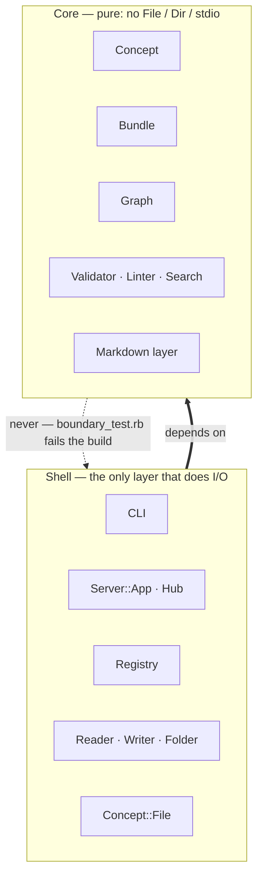

# Overview

The gem is two halves. The **core** is pure — [`Concept`](../model/concept.md),
[`Bundle`](../model/bundle.md), [`Graph`](../model/graph.md), the
[validator](../capabilities/validator.md), the [linter](../capabilities/linter.md),
the [search](../capabilities/search.md),
the [format layer](../format/) — logic that returns data and does no I/O. The
**shell** owns everything that touches the world: the on-disk handles
(`Concept::File`, `Bundle::{Reader,Writer,Folder}`), the
[server](../capabilities/graph-server.md) and its hub, the
[registry](../registry.md), and the [CLI](../cli.md).

# It is enforced, not just intended

`test/unit/boundary_test.rb` fails the build if a core file names a shell class or
reaches for `File` / `Dir` / `FileUtils` / stdio. The dependency rule is executable,
so the boundary cannot rot silently: **put new I/O in the shell, put new logic in
the core, pure.**

# Why it pays off

- **Testable without disk** — every feature runs against an in-memory
  [bundle](../model/bundle.md), so the suite is fast and the 2.4 Docker check is
  cheap. It is also what makes [integration first](integration-first.md)
  affordable: a shell this thin can be driven for real, with argv and streams and
  exit codes, in milliseconds — so the layer a user touches never has to be
  proven by proxy.
- **Embeddable** — the [library API](../capabilities/library-api.md) exposes the
  pure core to host apps that never want the gem's filesystem opinions.
- **Best-effort reads** — the reader collects unparseable files instead of
  raising, so the pure graph still renders while the shell reports the skips.

# Citations

[1] [test/unit/boundary_test.rb](https://github.com/serradura/okf-gem/blob/main/test/unit/boundary_test.rb) — the boundary made executable.
