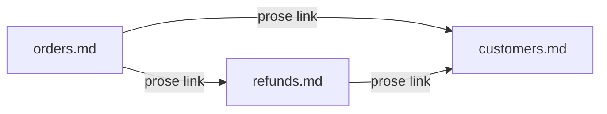

# Overview

A cross-link is an ordinary Markdown link from one concept's body to another
concept file. `OKF::Markdown::Links` extracts them, and that is the whole edge
mechanism: the [graph](../model/graph.md) is *emergent* — you never declare it,
it arises from the links you write. Good linking is good knowledge modelling.

Files are the nodes; the Markdown links in their bodies are the directed edges.
Nobody declared this graph — it fell out of three files linking each other.

# Untyped on purpose

A Markdown link asserts only "these two relate." The *kind* of relationship —
depends-on, supersedes, derived-from — lives in the **prose around the link**,
never in a made-up typed-edge syntax. Both a human and an agent already
understand a Markdown link, which is the point of the [dual audience](../overview.md).

# What counts as an edge

- **Bundle-relative links** (e.g. `/model/graph.md`) resolve to another concept
  and become a directed edge. Absolute bundle-relative targets are preferred so
  links survive file moves.
- **External links** — `http(s)://`, `mailto:` — are surfaced separately and are
  *not* graph edges.
- A link to a concept that does not exist yet is **not an error** (§5.3): it is
  not-yet-written knowledge, which consumers MUST tolerate and the
  [linter](../capabilities/linter.md) surfaces as backlog demand.

The [graph server](../capabilities/graph-server.md) draws these edges; a
degree-0 concept (no links in or out) is a *loose* file the
[read views](../capabilities/read-views.md) flag.

# Citations

[1] [lib/okf/markdown/links.rb](https://github.com/serradura/okf-gem/blob/main/lib/okf/markdown/links.rb) — link extraction.
[2] [SPEC.md §5](https://github.com/serradura/okf-gem/blob/main/lib/okf/skill/reference/SPEC.md) — cross-links and tolerance of broken targets.
