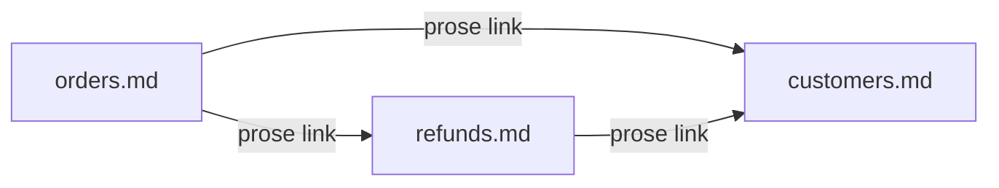

# Overview

A cross-link is an ordinary Markdown link from one concept's body to another
concept file. `OKF::Markdown::Links` extracts them, and that is the whole edge
mechanism: the graph (`@okf model/graph`) is *emergent* — you never declare it,
it arises from the links you write. Good linking is good knowledge modelling.

```mermaid
flowchart LR
  orders["orders.md"] -->|prose link| customers["customers.md"]
  orders -->|prose link| refunds["refunds.md"]
  refunds -->|prose link| customers
```

Files are the nodes; the Markdown links in their bodies are the directed edges.
Nobody declared this graph — it fell out of three files linking each other.

# Untyped on purpose

A Markdown link asserts only "these two relate." The *kind* of relationship —
depends-on, supersedes, derived-from — lives in the **prose around the link**,
never in a made-up typed-edge syntax. Both a human and an agent already
understand a Markdown link, which is the point of the dual audience (`@okf overview`).

# What counts as an edge

- **Bundle-relative links** (e.g. `/model/graph.md`) resolve to another concept
  and become a directed edge. Absolute bundle-relative targets are preferred so
  links survive file moves.
- **External links** — `http(s)://`, `mailto:` — are surfaced separately and are
  *not* graph edges.
- A link to a concept that does not exist yet is **not an error** (§6.1): it is
  not-yet-written knowledge, which consumers MUST tolerate and the
  linter (`@okf capabilities/linter`) surfaces as backlog demand.

The graph server (`@okf capabilities/graph-server`) draws these edges; a
degree-0 concept (no links in or out) is a *loose* file the
read views (`@okf capabilities/read-views`) flag.

# `@slug` is prose, not a link target

A `@slug` addresses a bundle for a *verb* — `okf lint @okf`, `okf search @all
<term>` — and addresses nothing at all inside a body. `OKF::Markdown::Links` has
no `@` handling whatsoever, so the two spellings someone reaches for fail in two
different ways, and neither is a cross-bundle edge:[^1]

- **`[okf](@okf)`** — `resolve` gates on `.md` and returns `nil`, so the link is
  not an edge and the validator never sees it. It warns in no bundle, ever, and
  renders on GitHub as a 404. The failure is *silent*, which is the worse half.
- **`[cli](@okf/cli.md)`** — ends in `.md`, so it resolves as a path *inside the
  linking bundle*: `@okf/cli.md`, a concept that does not exist. §6.1 tolerates
  it, so it warns and stays conformant — a phantom node in the wrong graph.

Nor can a concept reach out of its bundle by path: `OKF::Path.normalize_relative!`
rejects every `..` segment (`path contains unsafe segment`), so
`../../gems/okf/.okf/cli.md` is not a workaround anyone can reach for.
Cross-bundle reference is the registry's job by construction, not by convention.

**So a reference across the line is written in prose, with the address in
backticks** — the CLI (`@okf cli`), the linter (`@okf capabilities/linter`) —
exactly as the sections above do. Whether `@slug` should *become* a real target
is a kernel question: the format, the graph, the validator and the server all
get a say, and it lands in the base gem or nowhere. Until it is decided, writing
more of the links that do not resolve is what the rule forbids — and nothing
checks for them, which is why it is also listed in
[a rule nothing runs](/design/nothing-runs-it.md).
