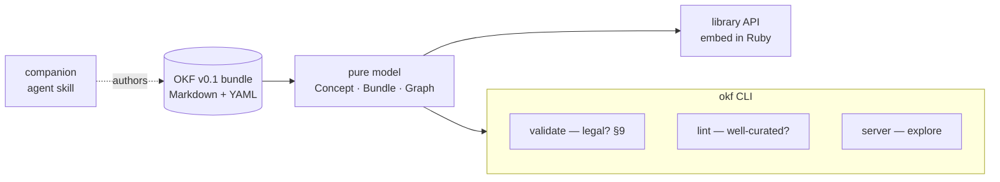

# Overview

**okf-gem** — `okf` on RubyGems — operates on [OKF v0.1](format/okf-format.md)
bundles: directories of Markdown files with YAML frontmatter that humans and
agents both read from one source. It does not define new knowledge storage; it
gives you leverage over knowledge that already lives as Markdown.

Over such a bundle the gem gives you five capabilities behind one
[command-line tool](cli.md):

| Capability | What it answers | Verb |
|------------|-----------------|------|
| [Conformance validator](capabilities/validator.md) | Is this a legal OKF bundle? (§9) | `validate` |
| [Curation linter](capabilities/linter.md) | Is it navigable, complete, fresh? | `lint` / `loose` |
| [Interactive graph server](capabilities/graph-server.md) | Can I explore it visually? | `server` |
| [Library API](capabilities/library-api.md) | Can my Ruby program use it? | (in-process) |
| [Companion agent skill](capabilities/agent-skill.md) | Can an agent author it? | `skill` |

Alongside those, a family of [read views](capabilities/read-views.md) —
`index`, `catalog`, `files`, `tags`, `stats`, `graph` — print the bundle at a
glance so an agent reads it without a browser.

# The two ideas it inherits from the format

- **Dual audience.** Every file serves a human skimming it *and* an agent
  extracting from it, so bodies are structural Markdown and
  [links](format/cross-links.md) are plain Markdown links — both readers already
  understand them.
- **The graph is emergent.** Files are nodes, Markdown links are edges. You never
  declare a graph; the gem [builds one](model/graph.md) from how concepts link.

# Design ethos

The gem is deliberately light so it runs on the Ruby an OS already ships. That
ethos is not incidental — it is enforced by [hard constraints](design/):
a [Ruby 2.4 floor](design/ruby-floor.md), exactly
[two runtime dependencies](design/runtime-dependencies.md), and a
[core/shell split](design/core-shell-split.md) that keeps all logic pure and
testable without disk. Everything else — no ActiveSupport, no build step, no
JavaScript toolchain — follows from those.

# Citations

[1] [README.md](https://github.com/serradura/okf-gem/blob/main/README.md) — the gem's own overview.
[2] [AGENTS.md](https://github.com/serradura/okf-gem/blob/main/AGENTS.md) — the maintainer guide.
