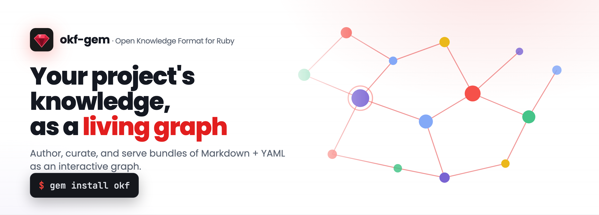
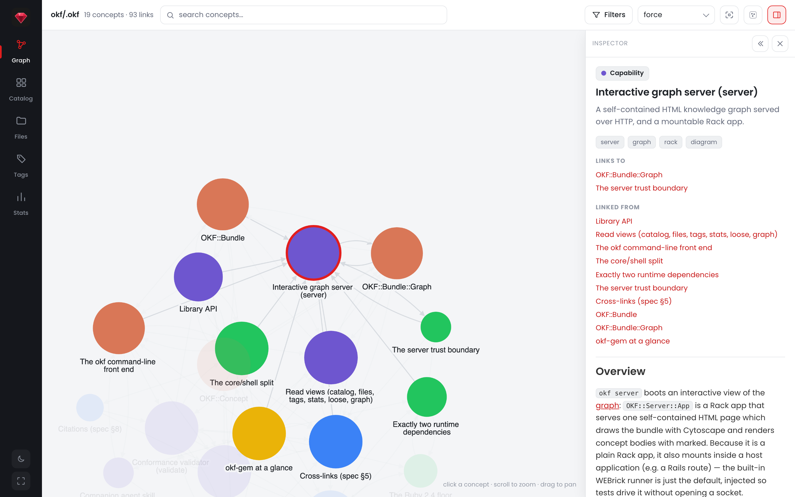

<p align="center">
  <a href="https://okfgem.com">
    <picture>
      <source media="(prefers-color-scheme: dark)" srcset=".github/hero-dark.png">
      
    </picture>
  </a>
</p>

<p align="center">
  <a href="https://rubygems.org/gems/okf"></a>
  <a href="https://rubygems.org/gems/okf"></a>
  <a href="https://github.com/serradura/okf-gem/pkgs/container/okf"></a>
  <a href="https://github.com/serradura/okf-gem/actions/workflows/main.yml"></a>
  <a href="https://github.com/serradura/okf-gem">= 2.4"></a>
  <a href="LICENSE.txt"></a>
  <a href="lib/okf/skill/reference/SPEC.md"></a>
  <a href="#claude-code-plugin"></a>
</p>

<p align="center">
  <b><a href="https://okfgem.com">Site</a></b> &nbsp;·&nbsp;
  <b><a href="https://okfgem.com/docs/">Docs</a></b> &nbsp;·&nbsp;
  <b><a href="https://demo.okfgem.com">Live demo</a></b> &nbsp;·&nbsp;
  <b><a href="https://claude.okfgem.com">Claude plugin</a></b> &nbsp;·&nbsp;
  <b><a href="https://docker.okfgem.com">Docker image</a></b>
</p>

**okf-gem** (`okf` on RubyGems or Docker) gives your project's knowledge one
durable home in your repo, in Markdown your team and your agents both read: the
decisions and the reasoning an agent cannot re-derive from the code, versioned
beside the code they explain.

One install carries the whole workflow, and that is the point of a single gem:

- an **Agent Skill**, so your agent writes and curates the knowledge instead of you;
- a **CLI and Ruby library**, so it stays correct: validated, linted, and searchable in milliseconds;
- a **Graph**, so anyone can see the shape of what the team knows, live or as one static file you can host anywhere.

The package is **Agent Skill + CLI/Lib + Graph**. It runs 100% local, adds no
service to your stack, and does not define a new place to keep knowledge: it
gives you leverage over the Markdown you already have.

## Why OKF

Project knowledge (why a service exists, what a metric really measures, the
reasoning a schema encodes) lives scattered across wikis, code comments, and
whoever happened to be in the room, and an agent re-derives it every session. OKF
gives it one durable, diffable home, versioned next to the code it describes and
read from the same file by people and agents alike. [OKF][okf] is an open,
vendor-neutral format (Google Cloud, 2026); this gem is the Ruby-native way to
work with it.

[okf]: https://cloud.google.com/blog/products/data-analytics/how-the-open-knowledge-format-can-improve-data-sharing

Knowledge already has several homes near an agent, and each holds a different
thing. None of the others is built for curated, durable team knowledge:

|                                | OKF bundle (this)                                     | `CLAUDE.md` / `AGENTS.md`  | Agent auto-memory        | Wiki / Notion    |
| ------------------------------ | ----------------------------------------------------- | -------------------------- | ------------------------ | ---------------- |
| Holds                          | curated team knowledge                                | standing instructions      | what one agent picked up | human docs       |
| Versioned with the code        | ✅                                                    | ✅                         | ❌                       | ❌               |
| Portable across agents         | ✅ plain Markdown + YAML                              | ⚠️ per-harness conventions | ❌ per-agent store       | ⚠️ export needed |
| Typed and queryable            | ✅ frontmatter + graph                                | ❌ prose                   | ❌                       | ⚠️ partially     |
| Reviewed in PRs                | ✅                                                    | ✅                         | ❌ implicit              | ⚠️ rarely        |
| Scales past one context window | ✅ progressive disclosure<br>(`okf index` + `search`) | ❌ loaded whole            | ⚠️ partially             | n/a              |
| Checked by tooling             | ✅ exit codes for CI<br>(`okf validate` + `lint`)     | ❌                         | ❌                       | ❌               |

The last two rows are this gem's job. Scaling past one context window is
progressive disclosure — `okf index` reads the map, `okf search` pulls only the
concepts a task needs, so the bundle is never loaded whole. And drift never
hides here: the other homes have no detector, but `okf validate` and `lint` turn
a bundle's drift into findings you can gate on in CI.

## What a bundle looks like

A bundle is just a directory; each concept is one Markdown file whose path is its
id. This repo documents _itself_ in OKF, so the tree below is real:

```
.okf/
├── index.md                       # progressive-disclosure map (root carries okf_version)
├── log.md                         # ISO-dated change history, newest first
├── overview.md
├── format/frontmatter.md
├── model/graph.md
└── capabilities/graph-server.md   # one concept = one file
```

The only hard requirement is YAML frontmatter with a non-empty `type`; everything
else is optional and tolerated when missing. A concept (here the real
`capabilities/graph-server.md`, body trimmed) reads:

```markdown
---
type: Capability
title: Interactive graph server (server)
description: A self-contained HTML knowledge graph served over HTTP, and a mountable Rack app.
resource: lib/okf/server/app.rb
tags: [server, graph, rack, diagram]
timestamp: 2026-07-11T12:00:00Z
---

# Overview

`okf server` boots an interactive view of the [graph](../model/graph.md) …
```

That bundle is this gem's own documentation. Clone the repo and run
`okf server .okf` to browse it as an interactive graph.

## Try it in four steps

From zero to your first bundle.

**1. Get the `okf` command.** Two ways in; either one puts `okf` on your `PATH`.

```bash
gem install okf                                        # with Ruby
curl -fsSL https://docker.okfgem.com/install.sh | sh   # no Ruby? Docker
```

**2. Install the skill.** Teach your agent the format — Claude Code, or any
other agent.

```bash
okf skill .claude   # or: okf skill .agents
```

**3. Start an agent session** where your project lives.

```bash
claude
```

**4. Make your first bundle.** Two ways in, by what you already have: docs keep
every word, code gets written up for you.

```
/okf migrate <path-to-your-docs>            # have docs? adopted in place, bodies verbatim
/okf produce based on <path-to-your-code>   # only code? the skill authors the concepts
```

> [!TIP]
> **Once you have a bundle**, run `/okf maintain` in the agent session to keep it
> in sync as the code changes, and `okf server <folder>` to explore it as a graph.
> In Claude Code, the [plugin](#claude-code-plugin) adds a post-edit curation hook
> that runs `validate` + `lint` for you.

The package, end to end:

<p align="center">
  <picture>
    <source media="(prefers-color-scheme: dark)" srcset=".github/overview-dark.png">
    
  </picture>
</p>

What the gem does, and which verb does it. This table is the map; **[the
docs](https://okfgem.com/docs/)** are the manual.

| Capability                                                    | What it answers                   | Verb                       |
| ------------------------------------------------------------- | --------------------------------- | -------------------------- |
| [Companion agent skill](https://okfgem.com/docs/skill/)     | Can an agent author it?           | `skill`                    |
| [Conformance validator](https://okfgem.com/docs/cli/validate/)       | Is this a legal OKF bundle?      | `validate`                 |
| [Curation linter](https://okfgem.com/docs/cli/lint/)                | Is it navigable, complete, fresh? | `lint` / `loose`           |
| [Ranked text search](https://okfgem.com/docs/cli/search/)             | Which concept covers X?           | `search`                   |
| [Read views](https://okfgem.com/docs/cli/)                 | What is in here, and where?       | `index` / `dirs` / `catalog` |
| [Interactive graph server](https://okfgem.com/docs/cli/server/) | Can I explore it visually?        | `server`                   |
| [Static render](https://okfgem.com/docs/cli/render/)                  | Can I ship a serverless snapshot? | `render`                   |
| [Library API](https://okfgem.com/docs/library/)               | Can my Ruby program use it?       | in-process                 |

And because knowledge rarely lives in one bundle, a per-user
[registry](.okf/registry.md) gives each bundle a name: `okf registry set ./docs`
once, then `@docs` works anywhere a `<dir>` does — from any directory — and a
bare `okf server` hosts every registered bundle behind one hub.

> [!TIP]
> **Browse the gem as knowledge, not just docs.** This README is the front door;
> the depth lives in the [`.okf/`](.okf) bundle this repo ships. Start at the
> [overview](.okf/overview.md), then follow the graph into the
> [capabilities](.okf/capabilities/) (what it does), the
> [design constraints](.okf/design/) (why it stays this light), and the
> [format itself](.okf/format/) (what it operates on). Run `okf server .okf` to
> walk the same bundle as an interactive graph.

**It installs on the Ruby your OS already ships** — every Ruby since 2.4, three
small dependencies, no native extension and no build step — so there is nothing
to provision and nothing to keep up to date. The
[design constraints](.okf/design/) that hold that line are enforced by tests on
every supported Ruby.

## Installation

> **In Claude Code**, the plugin is the fastest path: two commands install the whole
> toolchain (skill, `/okf:gem`, and the curation hook). See
> [Claude Code plugin](#claude-code-plugin). Everywhere else, install the gem:

```bash
gem install okf
# or, in a project
bundle add okf
```

Tested and supported on every Ruby from **2.4 through 4.0**. From a checkout,
`bundle exec rake install` builds and installs it locally.

### No Ruby? Use Docker

The official image bundles the CLI, so every `okf` command runs against a bundle
you mount at `/data`:

```bash
docker run --rm -v "$PWD:/data" ghcr.io/serradura/okf validate .
docker run --rm -v "$PWD:/data" -p 8808:8808 ghcr.io/serradura/okf server . --bind 0.0.0.0
```

Tired of the long line? The Docker-backed [`okf` command](https://docker.okfgem.com)
drops the prefix so every verb reads exactly like the native CLI:

```bash
curl -fsSL https://docker.okfgem.com/install.sh | sh   # PowerShell: irm https://docker.okfgem.com/install.ps1 | iex
okf validate .
okf server .
```

Images are published for `linux/amd64` and `linux/arm64` on
[ghcr.io](https://github.com/serradura/okf-gem/pkgs/container/okf).

## Where to go next

Installed. The rest of this page is each surface the gem gives you over a bundle,
in the order most people meet them:

- **[The graph](#the-graph)** — the whole bundle on one page, live or baked into a
  single HTML file you can host anywhere. Start here if you want to *see* it.
- **[Agent skill](#agent-skill)** — the verbs your agent runs to author, maintain
  and answer from a bundle, so you stay the editor rather than the typist.
- **[Claude Code plugin](#claude-code-plugin)** — that skill, a slash command and a
  post-edit curation hook, in two lines.
- **[Command line](#command-line)** — every view as scannable text or as JSON, with
  exit codes stable enough to gate CI on.
- **[Library](#library)** — `OKF::Bundle` in your own Ruby, and the graph as a Rack
  app you can mount in an app you already have.
- **[Extending okf](#extending-okf-and-running-it-safely)** — ship a verb as a gem,
  and what the page does and does not trust in a bundle you did not write.

Full reference for every verb and flag lives in
**[the docs](https://okfgem.com/docs/)**.

## The graph

<picture>
  <source media="(prefers-color-scheme: dark)" srcset=".github/server-dark.png">
  
</picture>

_The graph server on this repo's own [`.okf`](.okf) bundle, with the `overview`
concept selected. Try it live at
**[demo.okfgem.com](https://demo.okfgem.com)**._

One page, from a phone to a desktop: the navigation rail becomes a drawer, the
toolbar folds into a `⚙` sheet, and a tap opens a preview card at the bottom edge
rather than a panel over the whole viewport, so the graph stays live while you
read. Drag the card up for the neighbourhood, tap a link and it walks there in
place.

It is keyboard-first: **`⌘/Ctrl-K`** opens a command palette that searches
concepts, jumps to a view, and — behind a [hub](#one-registry-many-bundles) —
switches bundles. **`/`** jumps to the current view's search, **`?`** answers with
every shortcut. Cluster mode boxes the graph by directory and nests as deep as
your tree does.

To skip the server entirely, **`okf render <dir>`** writes that same page as one
self-contained HTML file, the whole bundle baked in, so you can publish the graph
on GitHub Pages or any static host.

### One registry, many bundles

The [registry](.okf/registry.md) is a per-user, ordered list of bundles in one
plain JSON file (`$OKF_HOME/registry.json`, default `~/.okf`) — hand-editable,
greppable, no database. It stores references, never content: the bundles stay in
the repos that own them.

```bash
okf registry set ./docs --as handbook   # give the bundle a name
okf lint @handbook                      # @slug works wherever a <dir> does, from anywhere
okf search @all rate limit              # ranked retrieval across every registered bundle
okf server                              # no args: the whole registry behind one hub
```

Behind the hub each bundle mounts at `/b/<slug>/`, `/b/` lists them all, and the
`⌘/Ctrl-K` palette both switches bundles and **searches every one at once** — type
a few words and the matching concepts appear with their bundle and a snippet, from
wherever you are.

The ⚙ rail opens **Bundles**, the registry on the graph page itself: make
default, rename, remove, where you are already reading. Those controls are the one
thing that does not follow you onto a network — bind anywhere but loopback and
they are refused outright, since `--bind 0.0.0.0` is how a personal tool becomes a
public one.

## Agent skill

The gem carries the [companion OKF agent skill](.okf/capabilities/agent-skill.md):
a `SKILL.md` plus reference and template files that teach a coding agent to
author, maintain, and consume OKF bundles and to drive the
[commands below](#command-line).
Because the skill ships inside the gem, installing the gem already puts the skill
on your machine, and the skill's CLI reference can never drift from the
executable it was released with.

The skill routes a small set of verbs. In Claude Code they run as `/okf:gem
<verb>`; used standalone, the skill infers the verb from your request.

| Verb             | What it does                                                                                                |
| ---------------- | ----------------------------------------------------------------------------------------------------------- |
| _(none)_         | Orient on the bundle and recommend the highest-value next move                                              |
| `search`         | Answer a question from the bundle, token-lean: the map, the finder, only the winning bodies                 |
| `produce`        | Create or extend a bundle from code, docs, or knowledge in people's heads                                   |
| `migrate`        | Adopt existing Markdown docs in place: frontmatter and reserved files added, bodies kept verbatim           |
| `maintain`       | Sync the bundle's content with reality after the code or docs change                                        |
| `refine`         | Restructure it for retrieval: evidence-first, cohesion over balance — proposes, never applies               |
| `consume`        | Use the bundle as context for a task, writing back what you learn                                           |
| `curate`         | Structural upkeep as it stands: `validate` + `lint` + `loose`                                               |
| `doctor`         | Install and verify the CLI, then doctor the bundle                                                          |
| `<okf-cli-verb>` | Run any CLI verb (`validate`, `lint`, `search`, `index`, `server`, the read views) and interpret its output |

Three of those look alike and are not, which is the distinction worth learning
first: **`curate`** keeps the bundle *sound* (the structure as it stands),
**`maintain`** keeps it *true* (the code changed, so the content must catch up),
and **`refine`** changes *where knowledge lives* — the folder a concept sits in,
a fact re-explained in three overviews. Reach for `refine` when nothing is wrong
and everything is hard to find. It reads the evidence, then hands you a proposal
— it never rearranges your bundle on its own.

Point it at your agent's config directory and the tree settles in its own
`skills/okf/` folder, so a shared skills directory never gets the files loose:

```bash
okf skill .claude     # Claude Code      -> .claude/skills/okf
okf skill .agents     # agent-agnostic   -> .agents/skills/okf
```

The resolved directory must be empty unless you pass `--force`, so a customized
skill is never clobbered.

## Claude Code plugin

This repository doubles as a Claude Code plugin marketplace, so the whole
toolchain installs with two commands inside Claude Code:

```
/plugin marketplace add serradura/okf-gem
/plugin install okf@okfgem
```

The plugin carries three pieces: the [`okf` skill](#agent-skill) above;
**`/okf:gem`**, a front door that hands its arguments to the skill unchanged (no
arguments: it orients on your bundle and recommends the next move, never
auto-runs); and a **curation hook** that runs `okf validate` + `okf lint` after
every edit inside a bundle and returns the findings as context. The checks are
the CLI's own, so the feedback is deterministic.

The hook stays silent outside bundles, and it is config-free to switch off:
`OKF_CURATE_DISABLED=1` turns it off, `OKF_CURATE_QUIET=1` keeps the findings
without the install suggestion, and an `<!-- okf-disable -->` comment skips one
file.

Prefer no plugin? `gem install okf && okf skill .claude` installs the skill
alone, and the skill itself instructs the agent to run the same checks after
editing a bundle.

## Command line

These verbs are written to be read by an **agent first and a person second** —
that is what the skill drives, with no wrapper in between. Every read verb takes
`--json`, the list views project down to the fields you ask for
(`--fields`/`--except`), so nothing pays for output it will not read, and the
exit codes are stable enough to branch on in CI. The same commands render as
scannable plain text when a human is the one looking.

```bash
okf validate  <dir|@slug>                        # is this legal OKF?
okf lint      <dir|@slug> [--fail-on warn]       # is it navigable, complete, fresh?
okf loose     <dir|@slug>                        # concepts with no links in or out
okf search    <dir|@slug…|@all> <term…>          # ranked retrieval; @all spans every bundle
okf index     <dir|@slug> [--dir D] [--depth N]  # the §6 map: index bodies, rollups, listings
okf dirs      <dir|@slug> [--dir D] [--depth N]  # the shape: every directory and what it holds
okf catalog | files | tags | types | stats  <dir|@slug>   # the browser views, on the CLI
okf graph     <dir|@slug> [--hubs] [--traffic]   # the raw graph; --hubs ranks concepts, --traffic dirs
okf server    [DIR|@slug…] [-p PORT] [--bind ADDR]   # the live graph: one bundle, or all of them
okf render    <dir|@slug> [-o FILE]              # the same page as one static, self-contained file
okf registry  list | set | del | default | rename    # name your bundles: @slug works anywhere
okf skill     <dest>                             # install the companion agent skill
okf --version
```

Exit codes: `0` success, `1` non-conformant bundle (or a `lint --fail-on`
threshold crossed), `2` usage error. Every flag is in `okf <verb> --help` and in
[the docs](https://okfgem.com/docs/).

```bash
$ okf validate docs
OKF v0.1 conformance — docs
  concepts: 37   index.md: 10   log.md: 1
  ! warn  features/link-suggestions.md: cross-link target not found: `/graph-view.md` (tolerated under §5.3)
  …
  ✓ conformant (33 warning(s))

$ okf server docs
serving 37 concepts at http://127.0.0.1:8808 (Ctrl-C to stop)

$ okf render docs > public/index.html   # the same page, static — host it anywhere
```

### Reading a big bundle a level at a time

A few hundred concepts is a map nobody reads whole, so `index` and `dirs` descend
instead of dumping. `--dir` takes a directory **and everything under it**,
`--depth N` bounds how far below that it goes, and the two compose the way you
actually walk a tree:

```bash
okf dirs  @handbook                       # the shape: every dir, what it holds directly and below
okf index @handbook --depth 1 --no-body   # the top of the map, no prose
okf index @handbook --dir platform/api    # now open one branch — with the chain that places it
```

Naming a `--dir` brings its ancestors along, marked `↑`, so a branch is never
shown adrift of the context that says what it is — the root `index.md`'s prose
first among it.

For an agent the saving is the whole point. On a 400-concept bundle the full
`okf index --json` is 313 KB; the skeleton it orients on is 2.8 KB:

```bash
okf index @handbook --json --depth 1 --except body,listing
```

## Library

`require "okf"` gives you the whole thing as Ruby objects — two layers: pure
in-memory data (`OKF::Concept`, `OKF::Bundle`) you build and analyze with no disk
involved, and on-disk handles (`OKF::Concept::File`, `OKF::Bundle::Folder`) that
add load/save/reload/delete, an "ActiveRecord for the filesystem".

```ruby
require "okf"

folder = OKF::Bundle::Folder.load("docs")
folder.concepts                  # => [OKF::Concept]
folder.validate                  # => §9 conformance result
folder.lint                      # => curation report
folder.graph                     # => nodes, edges, indexes

require "okf/server/app"
OKF::Server::App.new(folder)     # => a Rack app: the interactive graph, mountable
```

That last line is the point of the Rack app: the graph mounts inside an app you
already have, auth included. The [Rails guide](https://okfgem.com/docs/guides/rails/)
walks it, and the [library API](https://okfgem.com/docs/library/) covers
the pure layer, the writer, and the lower-level pieces.

### validate and lint are two different questions

`validate` (the [conformance validator](https://okfgem.com/docs/cli/validate/)) asks
_"is this legal OKF?"_ and implements the spec's
[§9](lib/okf/skill/reference/SPEC.md#9-conformance) exactly — which means it is
*forbidden* to reject a bundle for a broken link or a missing optional field.

`lint` (the [curation linter](https://okfgem.com/docs/cli/lint/)) asks the
complementary question, _"is this well-curated, navigable, trustworthy?"_, over
exactly those tolerated things: reachability, backlog, completeness, freshness,
provenance, hygiene. It is advisory and exits `0` even with findings unless you
pass `--fail-on warn`.

Keeping them apart is what lets you gate CI on conformance without gating it on
taste. `lint --json` is also the structured input an agent reads to reason about
the two things no checker can compute — contradictions, and *semantic* staleness.

## Extending okf, and running it safely

Publish a gem named `okf-*` carrying an `okf/plugin.rb` and installing it is the
whole installation: your verb answers to `okf` and behaves like a built-in.
Nothing an addon registers can displace one, and a broken addon is skipped rather
than taking the CLI down. Contract and threat model:
[extension points](.okf/design/extension-points.md).

The graph page treats a bundle as untrusted content: inlined data is escaped, and
every concept body is sanitized before it reaches the DOM, so a script hidden in
Markdown is stripped rather than run. It still loads libraries from a CDN, so
treat an unfamiliar bundle the way you would treat any document from a source you
do not know. Full write-up:
[server trust boundary](.okf/design/server-trust-boundary.md).

## Development

```bash
bin/setup               # install dependencies
bundle exec rake        # tests + RuboCop (what CI runs)
bundle exec rake test   # just the test suite
ruby -Ilib exe/okf validate <dir>   # run the CLI from a checkout
```

The suite runs on every supported Ruby; to check the 2.4 floor locally:

```bash
docker run --rm -v "$PWD":/src:ro ruby:2.4 bash -c \
  "cp -a /src /build && cd /build && rm -f Gemfile.lock && bundle install --quiet && bundle exec rake test"
```

The graph page has its own suite in a real browser (`bundle exec rake
browser:setup`, then `rake test:browser`). See [AGENTS.md](AGENTS.md) for the
maintainer guide.

## Contributing

Bug reports and pull requests are welcome on GitHub at
<https://github.com/serradura/okf-gem>. This project is intended to be a safe,
welcoming space for collaboration, and contributors are expected to adhere to
the [code of conduct](CODE_OF_CONDUCT.md).

## License

The gem is available as open source under the terms of the
[Apache License 2.0](https://www.apache.org/licenses/LICENSE-2.0) (see
`LICENSE.txt`). The Open Knowledge Format specification bundled with the skill
is authored by Google Cloud Platform and included under its own Apache-2.0
license, Copyright (c) Google LLC. See `NOTICE` and
`lib/okf/skill/reference/APACHE-2.0.txt`.

[okf-skills](https://github.com/scaccogatto/okf-skills) by Marco Boffo, a Python
OKF toolkit for Claude Code with a feature-rich interactive graph view, was an
early inspiration for this gem's Claude Code plugin and for the knowledge-as-code
comparison in [Why OKF](#why-okf). okf-gem takes a different shape: a Ruby-native
gem built around the `okf` CLI and an embeddable library.
