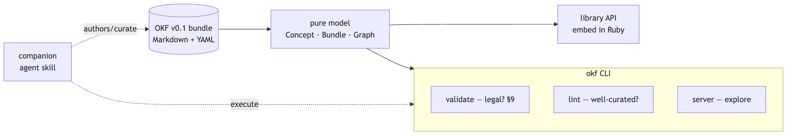
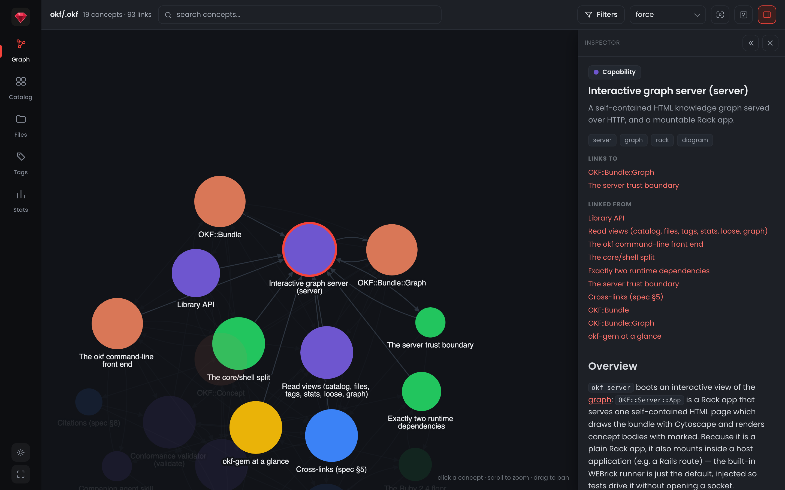

<p align="center">
<h1 align="center">
  <br/>
  <i>okf-gem</i>
</h1>
</p>

<p align="center">
  <i>A lightweight Ruby gem for OKF: author, curate, and serve bundles as an interactive graph.</i>
</p>

<p align="center">
  <a href="https://rubygems.org/gems/okf"></a>
  <a href="https://rubygems.org/gems/okf"></a>
  <a href="https://github.com/serradura/okf-gem/actions/workflows/main.yml"></a>
  <a href="https://github.com/serradura/okf-gem">= 2.4"></a>
  <a href="LICENSE.txt"></a>
  <a href="lib/okf/skill/reference/SPEC.md"></a>
  <a href="#claude-code-plugin"></a>
</p>

**okf-gem** — `okf` on RubyGems — reads, validates, lints, and serves
**Open Knowledge Format (OKF)** v0.1 bundles: directories of Markdown files with YAML frontmatter that humans and agents read from one source. It does not define a new place to keep knowledge; it gives you leverage over knowledge that already lives as Markdown. Each file is a _concept_; a directory of them is a _bundle_.

> **Quick start.** One skill, one command, a curation hook, and a CLI that
> validates, lints, indexes, and serves your Markdown as a graph. In Claude Code,
> add the plugin and let it set everything up: `/plugin marketplace add
> serradura/okf-gem`, then `/plugin install okf@okfgem`, then `/okf:gem`. On the
> command line: `gem install okf`, then `okf validate <dir>`.

Here is what it is able to do:

<!-- Diagram source: .github/overview.mmd. Regenerate both variants with mermaid-cli:
     mmdc -i .github/overview.mmd -o .github/overview-light.png -t default -b transparent -s 3
     mmdc -i .github/overview.mmd -o .github/overview-dark.png  -t dark    -b transparent -s 3 -->
<p align="center">
  <picture>
    <source media="(prefers-color-scheme: dark)" srcset=".github/overview-dark.png">
    
  </picture>
</p>

Over a bundle the gem gives you the `okf`
command-line tool (the library API is also usable in-process). Each capability
below links to the concept that documents it: this gem's own knowledge is an OKF
bundle, so you can read its design in the format it defends.

| Capability                                                    | What it answers                   | Verb             |
| ------------------------------------------------------------- | --------------------------------- | ---------------- |
| [Companion agent skill](.okf/capabilities/agent-skill.md)     | Can an agent author it?           | `skill`          |
| [Conformance validator](.okf/capabilities/validator.md)       | Is this a legal OKF bundle? (§9)  | `validate`       |
| [Curation linter](.okf/capabilities/linter.md)                | Is it navigable, complete, fresh? | `lint` / `loose` |
| [Interactive graph server](.okf/capabilities/graph-server.md) | Can I explore it visually?        | `server`         |
| [Library API](.okf/capabilities/library-api.md)               | Can my Ruby program use it?       | in-process       |

> [!TIP]
> **Browse the gem as knowledge, not just docs.** This README is the front door;
> the depth lives in the [`.okf/`](.okf) bundle this repo ships. Start at the
> [overview](.okf/overview.md), then follow the graph into the
> [capabilities](.okf/capabilities/) (what it does), the
> [design constraints](.okf/design/) (why it stays this light), and the
> [format itself](.okf/format/) (what it operates on). Run `okf server .okf` to
> walk the same bundle as an interactive graph.

It is deliberately light so it runs on the Ruby your OS already ships:

- works on every Ruby since 2.4, the same floor as [rack](https://github.com/rack/rack),
  its core dependency;
- only two runtime dependencies: `rack` (the server is a mountable Rack app)
  and `webrick` (unbundled from Ruby in 3.0);
- no ActiveSupport, no build step, no JavaScript toolchain — the
  [design constraints](.okf/design/) that hold this line are enforced by tests.

## Why OKF

Project knowledge (why a service exists, what a metric really measures, the
reasoning a schema encodes) lives scattered across wikis, code comments, and
whoever happened to be in the room, and an agent re-derives it every session. OKF
gives it one durable, diffable home, versioned next to the code it describes and
read from the same file by people and agents alike. [OKF][okf] is an open,
vendor-neutral format (Google Cloud, 2026); this gem is the Ruby-native way to
work with it.

[okf]: https://cloud.google.com/blog/products/data-analytics/how-the-open-knowledge-format-can-improve-data-sharing

Knowledge already has several homes near an agent, and each holds a different
thing. None of the others is built for curated, durable team knowledge:

|                                | OKF bundle (this)                               | `CLAUDE.md` / `AGENTS.md`  | Agent auto-memory        | Wiki / Notion    |
| ------------------------------ | ----------------------------------------------- | -------------------------- | ------------------------ | ---------------- |
| Holds                          | curated team knowledge                          | standing instructions      | what one agent picked up | human docs       |
| Versioned with the code        | ✅                                              | ✅                         | ❌                       | ❌               |
| Portable across agents         | ✅ plain Markdown + YAML                        | ⚠️ per-harness conventions | ❌ per-agent store       | ⚠️ export needed |
| Typed and queryable            | ✅ frontmatter + graph                          | ❌ prose                   | ❌                       | ⚠️ partially     |
| Reviewed in PRs                | ✅                                              | ✅                         | ❌ implicit              | ⚠️ rarely        |
| Scales past one context window | ✅ progressive disclosure (`okf index`)         | ❌ loaded whole            | ⚠️ partially             | n/a              |
| Checked by tooling             | ✅ (`okf validate` + `lint`), exit codes for CI | ❌                         | ❌                       | ❌               |

The last row is this gem's job. The other homes have no detector, so their
drift stays invisible; a bundle's drift shows up as findings you can gate on.

## What a bundle looks like

A bundle is just a directory; each concept is one Markdown file whose path is its
id. This repo documents _itself_ in OKF, so the tree below is real:

```
.okf/
├── index.md                       # progressive-disclosure map (root carries okf_version)
├── log.md                         # ISO-dated change history, newest first
├── overview.md
├── format/frontmatter.md
├── model/graph.md
└── capabilities/graph-server.md   # one concept = one file
```

The only hard requirement is YAML frontmatter with a non-empty `type`; everything
else is optional and tolerated when missing. A concept (here the real
`capabilities/graph-server.md`, body trimmed) reads:

```markdown
---
type: Capability
title: Interactive graph server (server)
description: A self-contained HTML knowledge graph served over HTTP, and a mountable Rack app.
resource: lib/okf/server/app.rb
tags: [server, graph, rack, diagram]
timestamp: 2026-07-11T12:00:00Z
---

# Overview

`okf server` boots an interactive view of the [graph](../model/graph.md) …
```

That bundle is this gem's own documentation. Clone the repo and run
`okf server .okf` to browse it as the graph diagrammed at the top of this file.

## Installation

**In Claude Code**, the plugin is the fastest path: two commands install the whole
toolchain (skill, `/okf:gem`, and the curation hook). See
[Claude Code plugin](#claude-code-plugin). Everywhere else, install the gem:

```bash
gem install okf
# or, in a project
bundle add okf
```

From a checkout, this builds the gem and installs it into your Ruby environment,
putting the `okf` command on your `PATH`:

```bash
bundle exec rake install
```

## Command line

```bash
okf validate  <dir> [--json]                            # check OKF v0.1 conformance (§9)
okf lint      <dir> [--json] [--fail-on warn] [...]     # report curation-quality issues
okf loose     <dir> [--json]                            # list files with no graph links, by folder
okf index     <dir> [--json] [--area A] [--no-body]     # progressive-disclosure map (§6): bodies, rollups, listings
okf server    <dir> [-p PORT] [--bind ADDR] [...]       # serve the interactive graph over HTTP
okf graph     <dir> [--json] [--minimal] [--no-body]    # print the knowledge graph
okf catalog | files | tags | types | stats  <dir> [--json]   # the browser views, on the CLI
okf skill     <dest> [--here] [--force]                 # install the companion agent skill
okf --version
```

Exit codes: `0` success, `1` non-conformant bundle (or a `lint --fail-on`
threshold crossed), `2` usage error.

```bash
$ okf validate docs
OKF v0.1 conformance — docs
  concepts: 37   index.md: 10   log.md: 1
  ! warn  features/link-suggestions.md: cross-link target not found: `/graph-view.md` (tolerated under §5.3)
  …
  ✓ conformant (33 warning(s))

$ okf server docs
serving 37 concepts at http://127.0.0.1:8808 (Ctrl-C to stop)
```

<picture>
  <source media="(prefers-color-scheme: dark)" srcset=".github/server-dark.png">
  
</picture>

_The graph server on this repo's own [`.okf`](.okf) bundle, with the
`capabilities/graph-server` concept selected._

`graph` and `server` are best-effort (§9): a file with invalid frontmatter is
skipped (and noted on stderr), not fatal, so one bad file never breaks the rest.
The [graph server](.okf/capabilities/graph-server.md) concept walks the request
flow and endpoints; the [server trust boundary](#server-trust-boundary) below
explains how the page handles a bundle you did not author.

`lint` (the [curation linter](.okf/capabilities/linter.md)) reports curation
quality (reachability, backlog, completeness, freshness, provenance, and hygiene)
separately from `validate`. It is advisory: it exits
`0` even with findings unless you opt into gating with `--fail-on warn`.

```bash
$ okf lint docs
OKF lint — docs
  concepts: 37   edges: 87   index.md: 10   log.md: 1
  hubs: features/chat/sources/source-ingestion-pipeline (×12), …

  Backlog
    · info  graph-view.md: referenced by 3 link(s) across 2 concept(s) but does not exist
    ! warn  features/index.md: index links to missing concept `../../CHANGELOG.md`
  Completeness
    · info  features/bundles/entry-editor.md: missing recommended field: description
  Hygiene
    ! warn  link-suggestions.md: reference-style link `[:approved_ids]` has no matching definition (an invisible broken link)

  ⚠ 3 warn, 31 info
```

`loose` lists the files that float in the graph: concepts with no cross-links
in or out (graph degree 0), grouped by folder. It is a curation lens over
`lint`'s `unlinked` check, distinct from `orphan`. An `index.md` listing makes a
file _reachable_ (not an orphan) but is not a graph edge, so a listed file
can still be loose. A loose file may be fine: a terminal leaf like a backlog
item is loose by design. `loose` surfaces the set for you to judge and
always exits `0`.

## Agent skill

The gem carries the [companion OKF agent skill](.okf/capabilities/agent-skill.md):
a `SKILL.md` plus reference
and template files that teach a coding agent to author, maintain, and consume OKF
bundles and to drive the commands above. Because the skill ships inside the gem,
installing the gem already puts the skill on your machine, and the skill's
CLI reference can never drift from the executable it was released with.
Using Claude Code? The [plugin](#claude-code-plugin) below installs this same
skill plus a post-edit curation hook.

The skill routes a small set of verbs. In Claude Code they run as `/okf:gem
<verb>`; used standalone, the skill infers the verb from your request.

| Verb             | What it does                                                              |
| ---------------- | ------------------------------------------------------------------------ |
| _(none)_         | Orient on the bundle and recommend the highest-value next move            |
| `produce`        | Create or extend a bundle from code, docs, or knowledge in people's heads |
| `maintain`       | Sync the bundle's content with reality after the code or docs change      |
| `consume`        | Use the bundle as context for a task, writing back what you learn         |
| `curate`         | Structural upkeep as it stands: `validate` + `lint` + `loose`             |
| `doctor`         | Install and verify the CLI, then doctor the bundle                        |
| `<okf-cli-verb>` | Run any CLI verb (`validate`, `lint`, `index`, `server`, the read views) and interpret its output |

Point it at your agent's config directory (or its skills directory) and the tree
settles in its own `skills/okf/` folder, so a shared skills directory never gets
the files loose:

```bash
okf skill .claude     # Claude Code      -> .claude/skills/okf
okf skill .agents     # agent-agnostic   -> .agents/skills/okf
```

The destination is required (no default). The skill lands in `<dest>/skills/okf`,
unless `<dest>` already ends in `skills` (→ `<dest>/okf`) or `okf` (used as-is).
Pass `--here` to paste the tree straight into `<dest>`, wherever it is. The
resolved directory must be empty unless you pass `--force`, so a customized skill
is never clobbered.

## Library

The gem (the [library API](.okf/capabilities/library-api.md)) is two layers: pure
in-memory data (`OKF::Concept`, `OKF::Bundle`)
you build, interrogate, and analyze with no disk involved, and on-disk
handles (`OKF::Concept::File`, `OKF::Bundle::Folder`) that add
load/save/reload/delete, an "ActiveRecord for the filesystem".

### Pure, in-memory (no disk)

Build knowledge straight from data, with no markdown round-trip, and run every
feature against it. This is the surface an embedding app (e.g. a Rails store)
uses to reuse the gem over knowledge it already holds as records:

```ruby
require "okf"

concept = OKF::Concept.new(
  path: "tables/orders.md",
  frontmatter: { "type" => "BigQuery Table", "title" => "Orders" },
  body: "Joined with [customers](/tables/customers.md).\n"
)

concept.id                       # => "tables/orders"
concept.links                    # => ["/tables/customers.md"]  (spec §5 cross-links)
concept.citations                # => [...]                     (spec §8 # Citations)
concept.external_links           # => [...]                     (URLs / mailto:)
concept.to_markdown              # => String  (inverse of OKF::Markdown::Frontmatter.parse)
concept.lint                     # => OKF::Bundle::Linter::Report  (the concept-scoped checks)

bundle = OKF::Bundle.new(concepts: [ concept ])   # also: reserved:, unparseable:
bundle.validate                  # => OKF::Bundle::Validator::Result  (spec §9 conformance)
bundle.lint                      # => OKF::Bundle::Linter::Report     (curation quality)
bundle.graph                     # => OKF::Bundle::Graph              (#nodes, #edges, #to_h)
```

### On disk

`OKF::Bundle::Folder` reads a directory into a pure bundle and materializes one
back; `OKF::Concept::File` is a single-file handle:

```ruby
folder = OKF::Bundle::Folder.load("docs")
folder.bundle                    # => OKF::Bundle  (the pure bundle it read)
folder.concepts                  # => [OKF::Concept]  (reserved files excluded)
folder.validate; folder.lint; folder.graph   # delegate to the pure core
folder.concept("tables/orders")  # => OKF::Concept::File
OKF::Server::App.new(folder)     # => a Rack app: the interactive graph server

# build in memory, then write it out (validates §9 before publishing):
OKF::Bundle::Folder.new(bundle: bundle, root: "out/dir").save

file = OKF::Concept::File.read(root: "docs", path: "tables/orders.md")
file.concept                     # => OKF::Concept (pure)
file.save; file.delete; file.reload
```

The lower-level pieces are usable on their own too: `OKF::Bundle::Validator.call(bundle)`,
`OKF::Bundle::Linter.call(bundle, min_body: 50)`, `OKF::Bundle::Graph.build(bundle)`,
`OKF::Markdown::Frontmatter.parse(markdown)`.

### Conformance model

`validate` (the [conformance validator](.okf/capabilities/validator.md)) implements
the spec's [§9 conformance definition](lib/okf/skill/reference/SPEC.md#9-conformance)
exactly. There are three hard conditions, all errors:

- **§9.1** every non-reserved file has a parseable YAML frontmatter block;
- **§9.2** every such block has a non-empty `type`;
- **§9.3** every `index.md`/`log.md` present follows §6/§7: a nested `index.md`
  has no frontmatter, a root `index.md` carries only `okf_version`, and `log.md`
  date headings are ISO `YYYY-MM-DD`.

Everything the spec marks as soft guidance is a warning and never makes a
bundle non-conformant: missing recommended fields, non-list tags, an unparseable
timestamp, and broken cross-links (§5.3), which consumers MUST tolerate.
`OKF::Bundle::Folder#save` validates before publishing, so it never writes a
bundle that fails §9.

### Curation model (`lint`)

`validate` asks _"is this §9-conformant?"_ and is forbidden by §9 to reject for
broken links or missing optional fields. `lint` asks the complementary question,
_"is this well-curated, navigable, trustworthy?"_, over exactly those tolerated
things. The two stay separate: `lint` has its own `OKF::Bundle::Linter` and
report, never emits conformance errors, and is advisory unless you pass
`--fail-on warn`.

Checks span six categories: **reachability** (orphans, not-in-index, disconnected
islands, unlinked), **backlog** (demand-ranked missing concepts, broken index entries),
**completeness** (stubs, missing title/description/timestamp), **freshness**
(`--stale-after`), **provenance** (uncited external claims, broken citations,
spec §8), and **hygiene** (duplicate titles, unused/undefined reference links,
self-links). Select with `--only`/`--except`; `--json` emits the full report as JSON.

Two loop concerns from the format's own guidance, _contradictions_ and _semantic_
staleness, need to understand meaning and are not computed here; `lint --json`
is the structured input an agent consumes to reason about those.

## Server trust boundary

> [!NOTE]
> The graph page defends against a bundle that carries active content in two
> places. It escapes any graph data inlined into the page (`<` becomes `&lt;`),
> which keeps that data from breaking out of its `<script>`. And it fetches each
> concept body on demand, then runs marked's HTML output through
> [DOMPurify](https://github.com/cure53/DOMPurify) before it reaches the DOM, so
> a script or event handler hidden in a Markdown body is stripped rather than
> executed. Descriptions are escaped on the server.
>
> That covers the paths that could run code. The page still loads Cytoscape,
> marked, and DOMPurify from a CDN and renders whatever links and diagrams a body
> contains, so treat an unfamiliar bundle the way you would treat any document
> from a source you do not know.

The [server trust boundary](.okf/design/server-trust-boundary.md) concept has the
full write-up: the two data paths, what sanitizing does, and what it leaves to
your judgment.

## Claude Code plugin

This repository doubles as a Claude Code plugin marketplace, so the whole
toolchain installs with two commands inside Claude Code:

```
/plugin marketplace add serradura/okf-gem
/plugin install okf@okfgem
```

The plugin carries three pieces:

| Piece         | What it does                                                                                                                                                                                                                                                                                                                                                                                                             |
| ------------- | ------------------------------------------------------------------------------------------------------------------------------------------------------------------------------------------------------------------------------------------------------------------------------------------------------------------------------------------------------------------------------------------------------------------------ |
| `okf` skill   | The [companion skill](#agent-skill) above, bundled with the plugin (a generated copy that `rake plugin:sync` keeps identical to `lib/okf/skill`).                                                                                                                                                                                                                                                                        |
| `/okf:gem`    | The front door, routed by argument. No arguments: orients on the CLI, the bundle, and what `validate`/`lint` report, then recommends the highest-value next move (never auto-runs). `doctor`: installs and verifies the `okf` CLI, then doctors the repo's bundle. `curate`: the full curation cycle (`validate` + `lint` + `loose`). Anything else (`produce`, `maintain`, `consume`, a CLI verb): handed to the skill. |
| Curation hook | After every Write or Edit inside a bundle, runs `okf validate` + `okf lint` and returns the findings as context. The checks are the CLI's own, so the feedback is deterministic.                                                                                                                                                                                                                                         |

The hook stays silent outside bundles, and when the CLI is missing it suggests
`/okf:gem` once per session instead of failing on each edit. It is config-free to
switch off: set `OKF_CURATE_DISABLED=1` to turn it off, `OKF_CURATE_QUIET=1` to
keep the findings but drop that suggestion, or drop an `<!-- okf-disable -->`
comment into a file to skip curation for that one.

Prefer no plugin? `gem install okf && okf skill .claude` installs the skill
alone, and the skill itself instructs the agent to run the same checks after
editing a bundle.

## Development

```bash
bin/setup               # install dependencies
bundle exec rake        # tests + RuboCop (what CI runs)
bundle exec rake test   # just the test suite
ruby -Ilib exe/okf validate <dir>   # run the CLI from a checkout
```

The suite runs on every supported Ruby; to check the 2.4 floor locally:

```bash
docker run --rm -v "$PWD":/app -w /app ruby:2.4 \
  bash -c "bundle install && bundle exec rake test"
```

## Contributing

Bug reports and pull requests are welcome on GitHub at
<https://github.com/serradura/okf-gem>. This project is intended to be a safe,
welcoming space for collaboration, and contributors are expected to adhere to
the [code of conduct](CODE_OF_CONDUCT.md).

## License

The gem is available as open source under the terms of the
[Apache License 2.0](https://www.apache.org/licenses/LICENSE-2.0) (see
`LICENSE.txt`). The Open Knowledge Format specification bundled with the skill
is authored by Google Cloud Platform and included under its own Apache-2.0
license, Copyright (c) Google LLC. See `NOTICE` and
`lib/okf/skill/reference/APACHE-2.0.txt`.

[okf-skills](https://github.com/scaccogatto/okf-skills) by Marco Boffo, a Python
OKF toolkit for Claude Code with a feature-rich interactive graph view, was an
early inspiration for this gem's Claude Code plugin and for the knowledge-as-code
comparison in [Why OKF](#why-okf). okf-gem takes a different shape: a Ruby-native
gem built around the `okf` CLI and an embeddable library.
