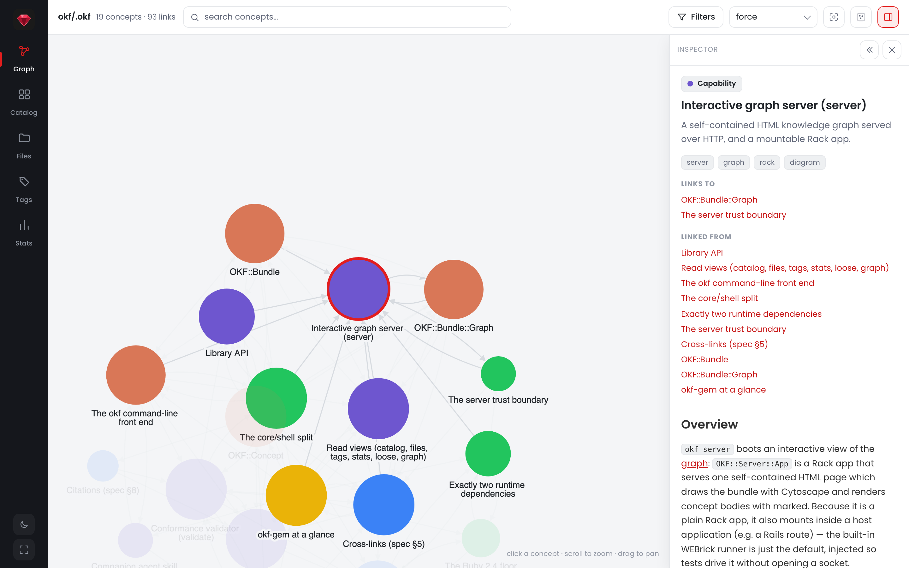

<p align="center">
  <a href="https://okfgem.com">
    <picture>
      <source media="(prefers-color-scheme: dark)" srcset=".github/hero-dark.png">
      
    </picture>
  </a>
</p>

<p align="center">
  <a href="https://rubygems.org/gems/okf"></a>
  <a href="https://rubygems.org/gems/okf"></a>
  <a href="https://github.com/serradura/okf/pkgs/container/okf"></a>
  <a href="https://github.com/serradura/okf/actions/workflows/main.yml"></a>
  <a href="https://github.com/serradura/okf">= 2.4"></a>
  <a href="LICENSE.txt"></a>
  <a href="gems/okf/lib/okf/skill/reference/SPEC.md"></a>
  <a href="#claude-code-plugin"></a>
</p>

<p align="center">
  <b><a href="https://okfgem.com">Site</a></b> &nbsp;·&nbsp;
  <b><a href="https://okfgem.com/docs/">Docs</a></b> &nbsp;·&nbsp;
  <b><a href="https://demo.okfgem.com">Live demo</a></b> &nbsp;·&nbsp;
  <b><a href="https://claude.okfgem.com">Claude plugin</a></b> &nbsp;·&nbsp;
  <b><a href="https://docker.okfgem.com">Docker image</a></b>
</p>

**okf** (on RubyGems and as a Docker image) gives your project's knowledge one
durable home in your repo, in Markdown your team and your agents both read: the
decisions and the reasoning an agent cannot re-derive from the code, versioned
beside the code they explain.

One install carries the whole workflow, and that is the point:

- an **Agent Skill**, so your agent writes and curates the knowledge instead of you;
- a **CLI and Ruby library**, so it stays correct: validated, linted, and searchable in milliseconds;
- a **Graph**, so anyone can see the shape of what the team knows, live or as one static file you can host anywhere.

It runs 100% local, adds no service to your stack, and does not define a new
place to keep knowledge: it gives you leverage over the Markdown you already
have.

## Why OKF

Project knowledge (why a service exists, what a metric really measures, the
reasoning a schema encodes) lives scattered across wikis, code comments, and
whoever happened to be in the room, and an agent re-derives it every session. OKF
gives it one durable, diffable home, versioned next to the code it describes and
read from the same file by people and agents alike. [OKF][okf] is an open,
vendor-neutral format (Google Cloud, 2026); this gem is the Ruby-native way to
work with it.

[okf]: https://cloud.google.com/blog/products/data-analytics/how-the-open-knowledge-format-can-improve-data-sharing

Knowledge already has several homes near an agent, and each holds a different
thing. None of the others is built for curated, durable team knowledge:

|                                | OKF bundle (this)                                     | `CLAUDE.md` / `AGENTS.md`  | Agent auto-memory        | Wiki / Notion    |
| ------------------------------ | ----------------------------------------------------- | -------------------------- | ------------------------ | ---------------- |
| Holds                          | curated team knowledge                                | standing instructions      | what one agent picked up | human docs       |
| Versioned with the code        | ✅                                                    | ✅                         | ❌                       | ❌               |
| Portable across agents         | ✅ plain Markdown + YAML                              | ⚠️ per-harness conventions | ❌ per-agent store       | ⚠️ export needed |
| Typed and queryable            | ✅ frontmatter + graph                                | ❌ prose                   | ❌                       | ⚠️ partially     |
| Reviewed in PRs                | ✅                                                    | ✅                         | ❌ implicit              | ⚠️ rarely        |
| Scales past one context window | ✅ progressive disclosure<br>(`okf index` + `search`) | ❌ loaded whole            | ⚠️ partially             | n/a              |
| Checked by tooling             | ✅ exit codes for CI<br>(`okf validate` + `lint`)     | ❌                         | ❌                       | ❌               |

The last two rows are this gem's job. Scaling past one context window is
progressive disclosure — `okf index` reads the map, `okf search` pulls only the
concepts a task needs, so the bundle is never loaded whole. And drift never
hides here: the other homes have no detector, but `okf validate` and `lint` turn
a bundle's drift into findings you can gate on in CI.

## What a bundle looks like

A bundle is just a directory; each concept is one Markdown file whose path is its
id. This repo documents _itself_ in OKF, so the tree below is real:

```
.okf/
├── index.md                       # progressive-disclosure map (root carries okf_version)
├── log.md                         # ISO-dated change history, newest first
├── overview.md
├── gems/okf-mcp.md                # one concept = one file
├── decisions/monorepo-layout.md
└── format/frontmatter.md
```

The only hard requirement is YAML frontmatter with a non-empty `type`; everything
else is optional and tolerated when missing. A concept reads as below — this is
the real `capabilities/graph-server.md` from the baseline gem's own bundle,
`gems/okf/.okf/`, with its body trimmed:

```markdown
---
type: Capability
title: Interactive graph server (server)
description: A self-contained HTML knowledge graph — served over HTTP as a mountable Rack app, one bundle or many behind a hub, or written to a single static file.
resource: gems/okf/lib/okf/server/app.rb
tags: [server, graph, rack, diagram]
generated:
  by: human:maintainer
  at: 2026-08-13T12:00:00Z
---

# Overview

`okf server` boots an interactive view of the [graph](../model/graph.md) …
```

The `.okf/` above is the **ecosystem's** map — a concept per gem, per plugin
item, per skill — and each gem carries its own bundle beside its code. Clone the
repo and run `okf server .okf` to browse the map as an interactive graph, or
`okf server gems/okf/.okf` for the baseline gem's.

### Trust, provenance, and lifecycle — OKF v0.2

Knowledge written continuously by agents raises questions a static corpus never
had to answer: who wrote this, who checked it, is it still current? OKF v0.2
makes them frontmatter — `generated` (who produced the content, and when),
`verified` (who confirmed it, deriving the trust tier every surface shows:
unverified · machine-confirmed · human-reviewed), `sources` with per-claim
footnote attribution, `status`, and `stale_after` — and this gem reads all of
it: as [catalog columns and `--status`/`--trust` filters](https://okfgem.com/docs/),
as the [graph page](#the-graph)'s third visual channel, and as
[lint](https://okfgem.com/docs/cli/lint/)'s provenance, attestation and
migration findings. Every family is optional, and a v0.1 bundle keeps reading
forever — two `lint` findings tell you exactly what a migration would change,
and never fail you for not having done it.

## How the pieces fit together

<p align="center">
  <picture>
    <source media="(prefers-color-scheme: dark)" srcset=".github/overview-dark.png">
    
  </picture>
</p>

> [!TIP]
> **Browse this repository as knowledge, not just docs.** This README is the
> front door; the depth lives in the five OKF bundles it carries. Start at the
> [ecosystem map](.okf) — the [gems](.okf/gems/), the [plugin](.okf/plugin/),
> the [skills](.okf/skills/), the [decisions](.okf/decisions/) and the
> [format itself](.okf/format/) — then open a gem's own bundle for its code:
> [`gems/okf/.okf/`](gems/okf/.okf). Run `okf server .okf` to walk the map as an
> interactive graph, or `okf search @all <term>` to reach every bundle at once.

**It installs on the Ruby your OS already ships** — every Ruby since 2.4, three
small dependencies, no native extension and no build step — so there is nothing
to provision and nothing to keep up to date. The
[design constraints](gems/okf/.okf/design/) that hold that line are enforced by
tests on every supported Ruby.

## What is in this repository

Every top-level name is a boundary, and the whole menu is one row each. A
directory under `gems/` is a gem, named for the gem it ships; everything else at
the root is named for what it is.

| Door | What lives there |
| ---- | ---------------- |
| [`gems/okf/`](gems/okf/README.md) | the `okf` gem — the agent skill, the CLI and library, ranked search, the graph. Everything above describes this one |
| [`gems/okf-mcp/`](gems/okf-mcp/README.md) | `okf mcp` — the MCP server over the same kernel: 14 read tools, any MCP host |
| [`gems/okf-tui/`](gems/okf-tui/README.md) | `okf tui` — the full-screen terminal UI, over one bundle or every registered one |
| [`gems/okf-pro/`](gems/okf-pro/README.md) | `okf pro` — writes an agent's knowledge repository, then enforces it at three doors |
| [`plugin/`](#claude-code-plugin) | the Claude Code plugin: that skill, `/okf:gem`, and a post-edit curation hook |
| [`.claude-plugin/`](.claude-plugin) | the marketplace manifest — this repository is its own marketplace |
| [`skills/`](#the-skill-without-the-gem) | the skills a generic installer reads: `okf`, and `okf-principles` |
| [`resources/`](resources/ci/github/README.md) | copy-paste recipes — today, CI that validates and lints your bundles on every push |
| [`.okf/`](.okf) | the ecosystem map: a concept per gem, per plugin item, per skill — plus the decisions and the format |
| [`.okf-registry.json`](.okf-registry.json) | every bundle in this tree, addressable as `@slug` from anywhere in it |
| [`Dockerfile`](Dockerfile) | builds the published image from `gems/okf/`, from a root build context |
| [`.github/`](.github/workflows) | the CI workflows, and the images this page renders |
| [`.claude/`](.claude/CLAUDE.md) | one line, pointing Claude Code at [`AGENTS.md`](AGENTS.md) |

## The graph

<picture>
  <source media="(prefers-color-scheme: dark)" srcset=".github/server-dark.png">
  
</picture>

_The graph server on this repo's own [`.okf`](.okf) bundle, with the `overview`
concept selected. Try it live at
**[demo.okfgem.com](https://demo.okfgem.com)**._

What the page does, and how `okf render` bakes the same thing into one static
file: [`gems/okf/README.md`](gems/okf/README.md#the-graph).

## Claude Code plugin

This repository doubles as a Claude Code plugin marketplace, so the whole
toolchain installs with two commands inside Claude Code:

```
/plugin marketplace add serradura/okf
/plugin install okf@okfgem
```

The plugin carries three pieces: the [`okf` skill](gems/okf/README.md#the-agent-skill);
**`/okf:gem`**, a front door that hands its arguments to the skill unchanged (no
arguments: it orients on your bundle and recommends the next move, never
auto-runs); and a **curation hook** that runs `okf validate` + `okf lint` after
every edit inside a bundle and returns the findings as context. The checks are
the CLI's own, so the feedback is deterministic.

The hook stays silent outside bundles, and it is config-free to switch off:
`OKF_CURATE_DISABLED=1` turns it off, `OKF_CURATE_QUIET=1` keeps the findings
without the install suggestion, and an `<!-- okf-disable -->` comment skips one
file.

Prefer no plugin? `gem install okf && okf skill .claude` installs the skill
alone, and the skill itself instructs the agent to run the same checks after
editing a bundle.

## The skill, without the gem

**Without the gem**, any agent that reads `SKILL.md` installs it straight from
this repository:

```bash
npx skills add serradura/okf                          # choose from the list
npx skills add serradura/okf --skill okf -a codex     # or name skill and agent
```

That path installs a generated copy — `rake skill:sync` writes it from the same
canonical tree the gem ships, and the build fails on any drift — so it tracks
this repository rather than the `okf` on your machine. `okf-principles` sits
beside it: the five structural principles the format implies, written to be
pointed at any instruction artifact rather than at a bundle.

## Extending okf, and running it safely

Publish a gem named `okf-*` carrying an `okf/plugin.rb` and installing it is the
whole installation: your verb answers to `okf` and behaves like a built-in.
Nothing an addon registers can displace one, and a broken addon is skipped rather
than taking the CLI down. Three ship here: `okf-mcp` adds `okf mcp`, the MCP
server any agent host can read a bundle through; `okf-tui` adds `okf tui`, the
full-screen terminal UI; and `okf-pro` adds `okf pro`, which writes an
agent's knowledge repository — bundle, hooks, pre-commit, CI, skill — and then
enforces it at all three doors. None of them needs a line of the baseline to
know it exists.
Contract and threat model:
[extension points](.okf/design/extension-points.md).

The graph page treats a bundle as untrusted content: inlined data is escaped, and
every concept body is sanitized before it reaches the DOM, so a script hidden in
Markdown is stripped rather than run. It still loads libraries from a CDN, so
treat an unfamiliar bundle the way you would treat any document from a source you
do not know. Full write-up:
[server trust boundary](gems/okf/.okf/design/server-trust-boundary.md).

## Development

From the repo root — plain `rake`, there is no root Gemfile:

```bash
rake              # every gem's default task (tests + RuboCop), then the repo-level lint
rake test         # every gem's test suite
rake okf          # validate + lint every registered .okf bundle
rake serve        # browse this project's own bundle as a graph
```

From any gem's directory, for work on that gem — `cd gems/okf-mcp`, `cd
gems/okf-tui` or `cd gems/okf-pro` follows the same three commands, and each has
its own README and CI job. From `gems/okf`, for work on the baseline itself:

```bash
cd gems/okf
bin/setup               # install dependencies
bundle exec rake        # tests + RuboCop (what CI runs)
bundle exec rake test   # just the test suite
ruby -Ilib exe/okf validate <dir>   # run the CLI from a checkout
```

The suite runs on every supported Ruby; to check the 2.4 floor locally, from the
repo root:

```bash
docker run --rm -v "$PWD":/src:ro ruby:2.4 bash -c \
  "cp -a /src /build && cd /build/gems/okf && rm -f Gemfile.lock && bundle install --quiet && bundle exec rake test"
```

The graph page has its own suite in a real browser (`bundle exec rake
browser:setup`, then `rake test:browser`, both from `gems/okf/`). See
[AGENTS.md](AGENTS.md) for the maintainer guide.

## Contributing

Bug reports and pull requests are welcome on GitHub at
<https://github.com/serradura/okf>. This project is intended to be a safe,
welcoming space for collaboration, and contributors are expected to adhere to
the [code of conduct](CODE_OF_CONDUCT.md).

## License

The gem is available as open source under the terms of the
[Apache License 2.0](https://www.apache.org/licenses/LICENSE-2.0) (see
`LICENSE.txt`). The Open Knowledge Format specification bundled with the skill
is authored by Google Cloud Platform and included under its own Apache-2.0
license, Copyright (c) Google LLC. See `NOTICE` and
`okf/lib/okf/skill/reference/APACHE-2.0.txt`.

[okf-skills](https://github.com/scaccogatto/okf-skills) by Marco Boffo, a Python
OKF toolkit for Claude Code with a feature-rich interactive graph view, was an
early inspiration for this gem's Claude Code plugin and for the knowledge-as-code
comparison in [Why OKF](#why-okf). okf takes a different shape: a Ruby-native
gem built around the `okf` CLI and an embeddable library.
