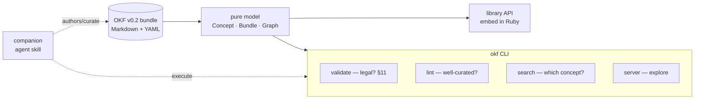

# Overview

**okf** — the gem on RubyGems — operates on OKF v0.2 (`@okf-eco format/okf-format`)
bundles: directories of Markdown files with YAML frontmatter that humans and
agents both read from one source. It does not define new knowledge storage; it
gives you leverage over knowledge that already lives as Markdown.

Over such a bundle the gem gives you seven capabilities behind one
[command-line tool](cli.md):

| Capability                                               | What it answers                   | Verb             |
| -------------------------------------------------------- | --------------------------------- | ---------------- |
| [Companion agent skill](capabilities/agent-skill.md)     | Can an agent author it?           | `skill`          |
| [Conformance validator](capabilities/validator.md)       | Is this a legal OKF bundle? (§11)  | `validate`       |
| [Curation linter](capabilities/linter.md)                | Is it navigable, complete, fresh? | `lint` / `loose` |
| [Ranked text search](capabilities/search.md)             | Which concept covers X?           | `search`         |
| [Interactive graph server](capabilities/graph-server.md) | Can I explore it visually?        | `server`         |
| [Static render](capabilities/render.md)                  | Can I ship a serverless snapshot? | `render`         |
| [Library API](capabilities/library-api.md)               | Can my Ruby program use it?       | (in-process)     |

Beside the gem's seven, the sibling surfaces. The
MCP server (`@okf-mcp design/the-tool-set`) (`okf-mcp`) projects the same kernel
onto the Model Context Protocol so any MCP-capable agent host reads these
bundles without a terminal — ten read-only tools, concepts as resources a host
can attach on its own, and the [skill's](capabilities/agent-skill.md) playbooks
as prompts. The enforcement layer (`@okf-eco gems/okf-pro`) (`okf-pro`)
goes the other way and is the only surface here that **writes**: it generates an
agent's knowledge repository — bundle, hooks, pre-commit, CI, skill — and then
holds it to a few invariants at all three doors, under a contract where a gate
that cannot check refuses rather than shrugs.

Alongside those, a family of [read views](capabilities/read-views.md) —
`index`, `catalog`, `files`, `types`, `tags`, `stats`, `graph` — print the bundle at a
glance so an agent reads it without a browser.

Knowledge rarely lives in one bundle, so `okf server` hosts one, several, or every
bundle in a per-user [registry](registry.md) — one hub, one switcher, no per-repo
server to remember.

# The two ideas it inherits from the format

- **Dual audience.** Every file serves a human skimming it _and_ an agent
  extracting from it, so bodies are structural Markdown and
  links (`@okf-eco format/cross-links`) are plain Markdown links — both readers already
  understand them.
- **The graph is emergent.** Files are nodes, Markdown links are edges. You never
  declare a graph; the gem [builds one](model/graph.md) from how concepts link.

# Design ethos

The gem is deliberately light so it runs on the Ruby an OS already ships. That
ethos is not incidental — it is enforced by [hard constraints](design/):
a [Ruby 2.4 floor](design/ruby-floor.md), exactly
[three runtime dependencies](design/runtime-dependencies.md), and a
[core/shell split](design/core-shell-split.md) that keeps all logic pure and
testable without disk. Everything else — no ActiveSupport, no build step, no
JavaScript toolchain — follows from those.
